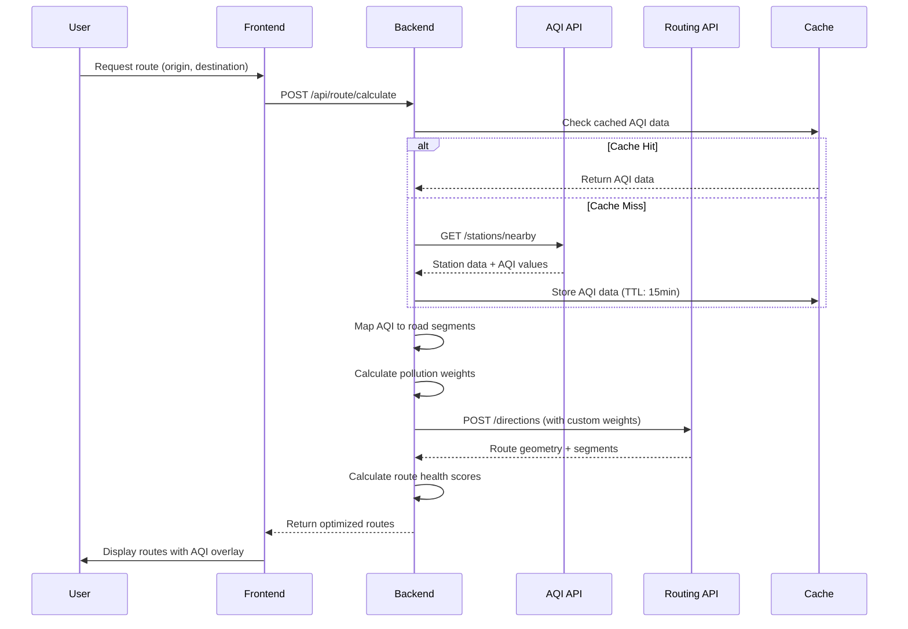
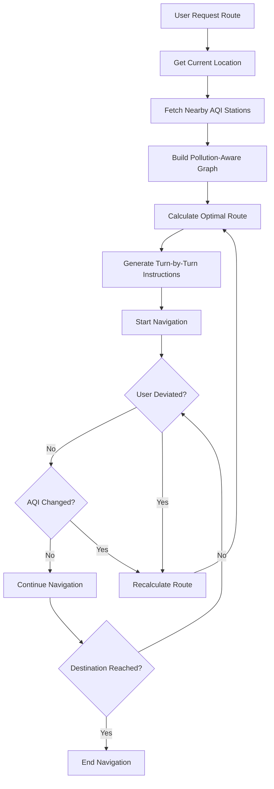
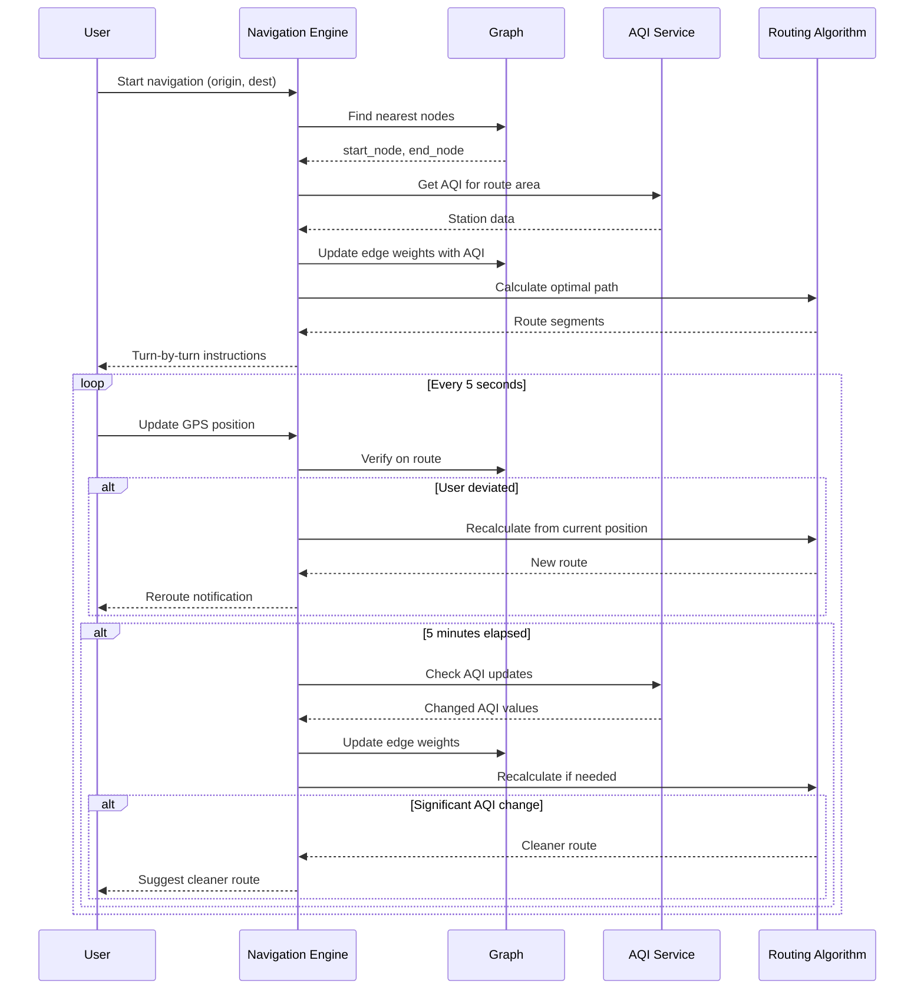
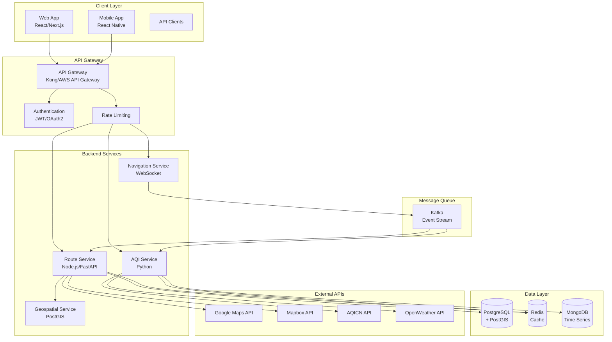
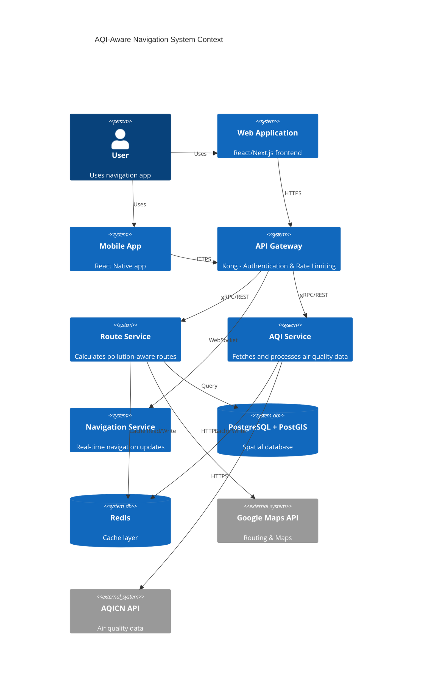

# Air-Quality-Aware Route Navigation System: Technical Architecture Report

**Version:** 1.0  
**Date:** May 11, 2026  
**Target Region:** Kolkata, India  
**Document Type:** System Design & Implementation Guide

---

## Table of Contents

1. [Project Overview](#1-project-overview)
2. [API Architecture](#2-api-architecture)
3. [AQI Station Processing Logic](#3-aqi-station-processing-logic)
4. [Route Finding Algorithms](#4-route-finding-algorithms)
5. [Clean Route Calculation](#5-clean-route-calculation)
6. [Navigation Logic](#6-navigation-logic)
7. [Geospatial Data Structures](#7-geospatial-data-structures)
8. [Overall System Design](#8-overall-system-design)
9. [Kolkata AQI Integration](#9-kolkata-aqi-integration)
10. [Performance & Scalability](#10-performance--scalability)
11. [Implementation Guide](#11-implementation-guide)
12. [Pseudocode & Sample Code](#12-pseudocode--sample-code)
13. [Challenges & Edge Cases](#13-challenges--edge-cases)
14. [Final Recommendations](#14-final-recommendations)

---

## 1. Project Overview

### 1.1 Purpose

The air-quality-aware route navigation system is designed to provide users with optimized travel routes that minimize exposure to air pollution while balancing travel time and distance. Unlike traditional navigation systems that optimize solely for distance or time, this platform incorporates Air Quality Index (AQI) data from monitoring stations to calculate healthier travel paths through urban environments.

### 1.2 How Clean-Air Route Navigation Works

Clean-air route navigation operates on the principle of pollution-aware pathfinding:

1. **AQI Data Ingestion**: The system continuously fetches real-time air quality measurements from monitoring stations distributed across the city
2. **Spatial Mapping**: Each road segment is assigned a pollution score based on proximity to AQI stations and measured pollution levels
3. **Multi-Objective Optimization**: Routes are calculated using a weighted graph where edge weights combine distance, time, and pollution exposure
4. **Route Ranking**: Multiple route options are presented to users, categorized by their health impact (Clean, Moderate, Polluted)
5. **Dynamic Recalculation**: As AQI values change or users deviate from planned routes, the system recalculates optimal paths

### 1.3 Relationship Between AQI Data and Route Optimization

AQI data serves as a dynamic cost modifier in the routing algorithm:

- **Traditional Routing**: Edge weight = f(distance, speed, traffic)
- **AQI-Aware Routing**: Edge weight = f(distance, speed, traffic, pollution_penalty)

The pollution penalty is calculated as:

$$
\text{Edge Weight} = \text{Base Weight} \times (1 + \alpha \times \text{AQI Normalized})
$$

Where:
- $\alpha$ = User's pollution sensitivity parameter (0.0 to 1.0)
- AQI Normalized = AQI value scaled to [0, 1] range based on health thresholds

### 1.4 Core Objectives

#### Finding Cleaner Travel Paths
- Identify routes with lower cumulative AQI exposure
- Prioritize roads passing through green zones, parks, and less congested areas
- Avoid industrial zones, high-traffic corridors, and pollution hotspots

#### Avoiding Polluted Regions
- Detect and route around areas with AQI > 150 (Unhealthy for Sensitive Groups)
- Apply heavy penalties to segments with AQI > 200 (Very Unhealthy)
- Provide alternative routes when primary path passes through high-pollution zones

#### Balancing Shortest Route vs Healthiest Route
- Offer multiple route options with different optimization priorities
- Allow users to adjust pollution vs time tradeoff via sensitivity slider
- Calculate Pareto-optimal routes showing tradeoff between time and health

---

## 2. API Architecture

### 2.1 API Categories

#### 2.1.1 AQI APIs

| API Provider | Data Source | Update Frequency | Coverage | Rate Limit |
|--------------|-------------|------------------|----------|------------|
| AQICN (World Air Quality) | Government stations + crowdsourced | Hourly | Global, 100+ countries | 1,000 requests/day (free) |
| OpenWeather Air Pollution | Satellite + ground stations | Hourly | Global | 60 calls/minute (free tier) |
| OpenAQ | Open government data | Variable (15min-1hr) | Global | 10,000 requests/month |
| CPCB India | Central Pollution Control Board | Hourly | India | No public API (scraping required) |
| WAQI (World Air Quality Index) | Multiple sources | Hourly | Global | 1,000 requests/day |

#### 2.1.2 Maps & Geolocation APIs

| API Provider | Services | Pricing | Notable Features |
|--------------|----------|---------|------------------|
| Google Maps Platform | Directions, Geocoding, Places, Elevation | $200/month free credit | Real-time traffic, extensive POI database |
| Mapbox | Directions, Geocoding, Static Maps | 50,000 free requests/month | Custom map styles, traffic tiles |
| OpenStreetMap (OSRM) | Routing engine | Free (self-hosted) | Open source, customizable |
| HERE Technologies | Routing, Traffic, Geocoding | Free tier available | High-quality traffic data |
| MapQuest | Directions, Geocoding | Limited free tier | Simple integration |

#### 2.1.3 Routing APIs

| API | Algorithm Support | Real-time Traffic | Custom Weights |
|-----|-------------------|-------------------|----------------|
| Google Directions API | Proprietary | Yes | Limited (via waypoints) |
| Mapbox Directions | OSRM-based | Yes | Yes (via annotations) |
| OSRM (Open Source) | Contraction Hierarchies | Yes (with external data) | Fully customizable |
| Valhalla | Multi-modal | Yes | Highly customizable cost models |

### 2.2 Request/Response Flow



### 2.3 Frontend-Backend Communication

**REST API Endpoints:**

```typescript
// Route Calculation
POST /api/v1/route/calculate
Request: {
  origin: { lat: 22.5726, lng: 88.3639 },
  destination: { lat: 22.5926, lng: 88.3839 },
  pollution_sensitivity: 0.7, // 0.0 to 1.0
  transport_mode: 'driving' | 'walking' | 'cycling'
}
Response: {
  routes: [
    {
      id: 'route_1',
      geometry: 'encoded_polyline',
      distance_m: 5400,
      duration_s: 720,
      health_score: 85, // 0-100, higher is better
      aqi_exposure: { avg: 45, max: 78 },
      category: 'clean' | 'moderate' | 'polluted',
      segments: [...]
    }
  ]
}

// AQI Stations
GET /api/v1/aqi/stations?bounds=lat1,lng1,lat2,lng2
Response: {
  stations: [
    {
      id: 'kolkata_001',
      name: 'Victoria Memorial',
      location: { lat: 22.5448, lng: 88.3426 },
      aqi: 67,
      pm25: 23.4,
      pm10: 45.2,
      last_updated: '2026-05-11T10:30:00Z'
    }
  ]
}
```

**WebSocket for Real-time Updates:**

```typescript
// Client connects
const ws = new WebSocket('wss://api.example.com/realtime');

// Server pushes AQI updates
ws.onmessage = (event) => {
  const update = JSON.parse(event.data);
  // { type: 'aqi_update', station_id: 'kolkata_001', aqi: 72 }
  updateRouteOverlay(update);
};
```

### 2.4 API Polling vs Real-time Updates

| Approach | Latency | Server Load | Complexity | Recommended For |
|----------|---------|-------------|------------|-----------------|
| Polling (5min) | 0-5min | Low | Low | MVP, low-traffic apps |
| Polling (1min) | 0-1min | Medium | Low | Moderate traffic |
| WebSocket Push | <1s | Medium | High | High-traffic, real-time |
| Server-Sent Events | <5s | Low-Medium | Medium | Medium traffic |

**Recommended Hybrid Approach:**
- Poll AQI APIs every 5-10 minutes
- Use WebSocket/SSE to push updates to connected clients
- Cache AQI data with 15-minute TTL

### 2.5 Sample API Requests

#### Google Maps Directions API

```bash
curl -X POST "https://routes.googleapis.com/directions/v2:computeRoutes" \
  -H "Content-Type: application/json" \
  -H "X-Goog-Api-Key: YOUR_API_KEY" \
  -H "X-Goog-FieldMask: routes.duration,routes.distanceMeters,routes.polyline" \
  -d '{
    "origin": { "location": { "latLng": { "latitude": 22.5726, "longitude": 88.3639 } } },
    "destination": { "location": { "latLng": { "latitude": 22.5926, "longitude": 88.3839 } } },
    "travelMode": "DRIVE",
    "routingPreference": "TRAFFIC_AWARE"
  }'
```

**Response:**
```json
{
  "routes": [
    {
      "distanceMeters": 5432,
      "duration": "482s",
      "polyline": { "encodedPolyline": "kmlnH...xyz" }
    }
  ]
}
```

#### Mapbox Directions with Custom Annotations

```bash
curl "https://api.mapbox.com/directions/v5/mapbox/driving/88.3639,22.5726;88.3839,22.5926" \
  -H "Content-Type: application/json" \
  -G \
  --data-urlencode "annotations=speed,congestion,distance" \
  --data-urlencode "access_token=YOUR_ACCESS_TOKEN"
```

#### AQICN API

```bash
curl "https://api.waqi.info/map/bounds/?latlng=22.4,88.2,22.7,88.6&token=YOUR_TOKEN"
```

**Response:**
```json
{
  "data": [
    {
      "uid": 12345,
      "aqi": 67,
      "idx": 12345,
      "station": { "name": "Victoria Memorial, Kolkata" },
      "lat": 22.5448,
      "lon": 88.3426,
      "iaqi": { "pm25": { "v": 23.4 }, "pm10": { "v": 45.2 } }
    }
  ]
}
```

#### OpenWeather Air Pollution API

```bash
curl "https://api.openweathermap.org/data/2.5/air_pollution?lat=22.5726&lon=88.3639&appid=YOUR_API_KEY"
```

**Response:**
```json
{
  "coord": { "lon": 88.3639, "lat": 22.5726 },
  "list": [
    {
      "dt": 1715437200,
      "main": { "aqi": 3 },
      "components": { "co": 234.5, "no": 0.02, "no2": 12.3, "o3": 45.2, "so2": 5.1, "pm2_5": 23.4, "pm10": 45.2, "nh3": 1.2 }
    }
  ]
}
```

### 2.6 Authentication & Token Handling

**API Key Management:**

```typescript
// Environment variables
const API_KEYS = {
  google: process.env.GOOGLE_MAPS_API_KEY,
  mapbox: process.env.MAPBOX_ACCESS_TOKEN,
  aqicn: process.env.AQICN_TOKEN,
  openweather: process.env.OPENWEATHER_API_KEY
};

// Rate limiting wrapper
class RateLimitedAPIClient {
  private requests: Map<string, number[]> = new Map();
  private limits: Map<string, { count: number; window: number }> = new Map();
  
  async call(api: string, url: string): Promise<Response> {
    const now = Date.now();
    const limit = this.limits.get(api);
    const timestamps = this.requests.get(api) || [];
    
    // Clean old timestamps
    const validTimestamps = timestamps.filter(t => now - t < limit.window * 1000);
    
    if (validTimestamps.length >= limit.count) {
      const oldest = Math.min(...validTimestamps);
      const waitTime = (oldest + limit.window * 1000) - now;
      await new Promise(r => setTimeout(r, waitTime));
    }
    
    validTimestamps.push(now);
    this.requests.set(api, validTimestamps);
    
    return fetch(url);
  }
}
```

### 2.7 Rate Limits & Optimization Techniques

| API | Free Tier Limit | Optimization Strategy |
|-----|----------------|----------------------|
| Google Maps | $200/month (~28,000 routes) | Cache routes, batch requests, use Directions API only |
| Mapbox | 50,000 requests/month | Use static maps for display, cache tile data |
| AQICN | 1,000 requests/day | Cache for 15min, use spatial clustering |
| OpenWeather | 60 calls/minute | Implement request queue, use bulk endpoints |

**Optimization Techniques:**

1. **Spatial Clustering**: Group nearby stations and fetch data for clusters
2. **Request Batching**: Combine multiple station queries into single API call
3. **Intelligent Caching**: 
   - AQI data: 15-minute TTL
   - Route geometry: 1-hour TTL
   - Geocoding results: 30-day TTL
4. **Priority Queuing**: Prioritize active user requests over background updates
5. **Fallback Mechanisms**: Use multiple AQI providers with failover

---

## 3. AQI Station Processing Logic

### 3.1 Detecting Nearby AQI Monitoring Stations

The system uses a multi-stage approach to identify relevant monitoring stations:

#### Stage 1: Bounding Box Query

```python
def get_stations_in_bounds(bounds: BoundingBox) -> List[Station]:
    """
    Fetch all stations within a bounding box
    bounds: { min_lat, max_lat, min_lng, max_lng }
    """
    # Expand bounds by buffer to ensure coverage
    buffer = 0.05  # ~5km
    expanded_bounds = {
        'min_lat': bounds['min_lat'] - buffer,
        'max_lat': bounds['max_lat'] + buffer,
        'min_lng': bounds['min_lng'] - buffer,
        'max_lng': bounds['max_lng'] + buffer
    }
    
    # Query AQI API
    url = f"https://api.waqi.info/map/bounds/?latlng=" \
          f"{expanded_bounds['min_lat']},{expanded_bounds['min_lng']}," \
          f"{expanded_bounds['max_lat']},{expanded_bounds['max_lng']}"
    
    response = requests.get(url, params={'token': AQI_TOKEN})
    return parse_stations(response.json())
```

#### Stage 2: Route Buffer Query

For a given route, create a buffer zone and query stations within it:

```python
def get_stations_near_route(route_geometry: LineString, buffer_km: float = 5) -> List[Station]:
    """
    Get all stations within buffer distance of route
    """
    # Create buffer around route
    route_buffer = route_geometry.buffer(buffer_km / 111)  # Convert km to degrees
    
    # Get bounding box of buffer
    minx, miny, maxx, maxy = route_buffer.bounds
    
    # Fetch stations in bounding box
    stations = get_stations_in_bounds({
        'min_lat': miny,
        'max_lat': maxy,
        'min_lng': minx,
        'max_lng': maxx
    })
    
    # Filter to stations actually within buffer
    nearby_stations = []
    for station in stations:
        point = Point(station['lon'], station['lat'])
        if route_buffer.contains(point):
            nearby_stations.append(station)
    
    return nearby_stations
```

### 3.2 Determining Nearest AQI Stations from User Route

#### Haversine Distance Formula

The Haversine formula calculates the great-circle distance between two points on a sphere:

$$
a = \sin^2\left(\frac{\Delta\phi}{2}\right) + \cos\phi_1 \cdot \cos\phi_2 \cdot \sin^2\left(\frac{\Delta\lambda}{2}\right)
$$

$$
c = 2 \cdot \text{arctan2}\left(\sqrt{a}, \sqrt{1-a}\right)
$$

$$
d = R \cdot c
$$

Where:
- $\phi$ = latitude in radians
- $\lambda$ = longitude in radians
- $\Delta\phi, \Delta\lambda$ = differences in coordinates
- $R$ = Earth's radius (6,371 km)

**Implementation:**

```python
import math

def haversine_distance(lat1: float, lon1: float, lat2: float, lon2: float) -> float:
    """
    Calculate distance between two points in kilometers
    """
    R = 6371.0  # Earth's radius in km
    
    # Convert to radians
    lat1_rad = math.radians(lat1)
    lon1_rad = math.radians(lon1)
    lat2_rad = math.radians(lat2)
    lon2_rad = math.radians(lon2)
    
    # Differences
    dlat = lat2_rad - lat1_rad
    dlon = lon2_rad - lon1_rad
    
    # Haversine formula
    a = (math.sin(dlat / 2) ** 2 + 
         math.cos(lat1_rad) * math.cos(lat2_rad) * 
         math.sin(dlon / 2) ** 2)
    c = 2 * math.atan2(math.sqrt(a), math.sqrt(1 - a))
    
    return R * c
```

#### K-Nearest Neighbors (KNN) for Station Selection

```python
def find_nearest_stations(point: Tuple[float, float], 
                         stations: List[Station], 
                         k: int = 3) -> List[Tuple[Station, float]]:
    """
    Find k nearest stations to a point
    Returns: List of (station, distance) tuples sorted by distance
    """
    # Calculate distances
    station_distances = []
    for station in stations:
        distance = haversine_distance(
            point[0], point[1], 
            station['lat'], station['lon']
        )
        station_distances.append((station, distance))
    
    # Sort by distance and return top k
    station_distances.sort(key=lambda x: x[1])
    return station_distances[:k]
```

### 3.3 Spatial Indexing for Efficient Queries

#### Geospatial Indexing Approaches

| Index Type | Query Complexity | Build Time | Memory Usage | Best For |
|------------|------------------|------------|--------------|----------|
| Naive (Linear Scan) | O(n) | O(1) | O(n) | Small datasets (<1000 points) |
| KD-Tree | O(log n) average | O(n log n) | O(n) | Static datasets, low dimensions |
| R-Tree | O(log n) average | O(n log n) | O(n) | Dynamic datasets, spatial queries |
| Quadtree | O(log n) average | O(n log n) | O(n) | Uniformly distributed data |
| Geohash Grid | O(1) with hash | O(n) | O(n) | Distributed systems |

#### KD-Tree Implementation

```python
from scipy.spatial import KDTree
import numpy as np

class StationIndex:
    def __init__(self, stations: List[Station]):
        """
        Build KD-Tree from station coordinates
        """
        # Convert to numpy array [lon, lat]
        coords = np.array([[s['lon'], s['lat']] for s in stations])
        self.tree = KDTree(coords)
        self.stations = stations
    
    def query_radius(self, point: Tuple[float, float], radius_km: float) -> List[Station]:
        """
        Find all stations within radius (in kilometers)
        """
        # Convert km to degrees (approximate)
        radius_deg = radius_km / 111.0
        
        # Query tree
        indices = self.tree.query_ball_point(point, radius_deg)
        
        return [self.stations[i] for i in indices]
    
    def query_nearest(self, point: Tuple[float, float], k: int = 1) -> List[Station]:
        """
        Find k nearest stations
        """
        distances, indices = self.tree.query(point, k=k)
        
        if k == 1:
            return [self.stations[indices]]
        
        return [self.stations[i] for i in indices]
```

#### R-Tree with PostGIS

```sql
-- Create spatial index on stations table
CREATE INDEX idx_stations_location ON stations USING GIST (location);

-- Query stations within radius
SELECT id, name, aqi, location 
FROM stations 
WHERE ST_DWithin(
    location, 
    ST_MakePoint(88.3639, 22.5726)::geography, 
    5000  -- 5km radius
)
ORDER BY location <-> ST_MakePoint(88.3639, 22.5726)::geography;
```

### 3.4 Mapping AQI Station Data to Road Segments

#### Spatial Join Approach

```python
from shapely.geometry import Point, LineString
from shapely.ops import nearest_points

def assign_aqi_to_road_segments(road_network: List[RoadSegment], 
                                stations: List[Station],
                                max_distance_km: float = 2) -> List[RoadSegment]:
    """
    Assign AQI values to road segments based on nearest stations
    """
    # Create spatial index for stations
    station_points = [Point(s['lon'], s['lat']) for s in stations]
    station_index = StationIndex(stations)
    
    for segment in road_network:
        # Get segment geometry
        segment_geom = LineString(segment['coordinates'])
        
        # Find nearest stations
        nearest = station_index.query_nearest(
            (segment_geom.centroid.x, segment_geom.centroid.y),
            k=3
        )
        
        # Calculate weighted average based on distance
        weighted_aqi = 0
        total_weight = 0
        
        for station, distance in nearest:
            if distance <= max_distance_km:
                # Weight by inverse distance squared
                weight = 1 / (distance ** 2 + 0.1)  # Avoid division by zero
                weighted_aqi += station['aqi'] * weight
                total_weight += weight
        
        # Assign AQI to segment
        if total_weight > 0:
            segment['aqi'] = weighted_aqi / total_weight
        else:
            segment['aqi'] = None  # No nearby station
    
    return road_network
```

### 3.5 Interpolation Techniques Between Stations

#### Inverse Distance Weighting (IDW)

$$
\hat{Z}(x) = \frac{\sum_{i=1}^{n} \frac{Z_i}{d_i^p}}{\sum_{i=1}^{n} \frac{1}{d_i^p}}
$$

Where:
- $\hat{Z}(x)$ = interpolated value at point $x$
- $Z_i$ = observed value at station $i$
- $d_i$ = distance from point $x$ to station $i$
- $p$ = power parameter (typically $p=2$)

```python
def idw_interpolation(point: Tuple[float, float], 
                      stations: List[Tuple[Station, float]],
                      power: float = 2) -> float:
    """
    Inverse Distance Weighting interpolation
    """
    numerator = 0.0
    denominator = 0.0
    
    for station, distance in stations:
        if distance == 0:
            return station['aqi']  # Exact match
        
        weight = 1.0 / (distance ** power)
        numerator += station['aqi'] * weight
        denominator += weight
    
    return numerator / denominator if denominator > 0 else None
```

#### Kriging (Gaussian Process)

For more sophisticated interpolation, use Kriging:

```python
from sklearn.gaussian_process import GaussianProcessRegressor
from sklearn.gaussian_process.kernels import RBF, ConstantKernel
import numpy as np

class KrigingInterpolator:
    def __init__(self):
        kernel = ConstantKernel(1.0) * RBF(length_scale=1.0)
        self.gp = GaussianProcessRegressor(kernel=kernel)
    
    def fit(self, stations: List[Station]):
        """
        Fit Gaussian Process to station data
        """
        X = np.array([[s['lon'], s['lat']] for s in stations])
        y = np.array([s['aqi'] for s in stations])
        self.gp.fit(X, y)
    
    def predict(self, points: List[Tuple[float, float]]) -> np.ndarray:
        """
        Predict AQI at given points
        """
        X = np.array(points)
        return self.gp.predict(X, return_std=True)
```

### 3.6 Handling Missing AQI Values

#### Strategies for Missing Data

| Strategy | Description | Use Case |
|----------|-------------|----------|
| Nearest Neighbor | Use value from closest station | Small gaps |
| Temporal Interpolation | Use previous hour's value | Temporary station outage |
| Spatial Interpolation | IDW/Kriging from nearby stations | Sparse coverage |
| Regional Average | Use city-wide average | No nearby stations |
| Machine Learning | Predict from traffic, weather, time | Advanced systems |

```python
def handle_missing_aqi(segment: RoadSegment, 
                      stations: List[Station],
                      historical_data: Dict) -> float:
    """
    Handle missing AQI values with fallback strategies
    """
    if segment['aqi'] is not None:
        return segment['aqi']
    
    # Strategy 1: Nearest neighbor
    nearest = find_nearest_stations(
        segment['centroid'], 
        stations, 
        k=1
    )
    if nearest and nearest[0][1] < 5.0:  # Within 5km
        return nearest[0][0]['aqi']
    
    # Strategy 2: Regional average
    region_stations = [s for s in stations if s['region'] == segment['region']]
    if region_stations:
        return np.mean([s['aqi'] for s in region_stations])
    
    # Strategy 3: City average (last resort)
    city_avg = historical_data.get('city_average_aqi', 100)
    return city_avg
```

---

## 4. Route Finding Algorithms

### 4.1 Dijkstra's Algorithm

**Time Complexity:** $O((V + E) \log V)$ with binary heap  
**Space Complexity:** $O(V)$

Dijkstra's algorithm finds the shortest path from a source node to all other nodes in a weighted graph with non-negative edge weights.

```python
import heapq
from typing import Dict, List, Tuple, Set

def dijkstra(graph: Dict[str, Dict[str, float]], 
             start: str, 
             end: str) -> Tuple[List[str], float]:
    """
    Find shortest path using Dijkstra's algorithm
    
    Args:
        graph: Adjacency list {node: {neighbor: weight}}
        start: Starting node
        end: Target node
    
    Returns:
        (path, total_weight)
    """
    # Priority queue: (distance, node, path)
    pq = [(0, start, [start])]
    visited: Set[str] = set()
    
    while pq:
        distance, current, path = heapq.heappop(pq)
        
        if current in visited:
            continue
        
        if current == end:
            return path, distance
        
        visited.add(current)
        
        for neighbor, weight in graph.get(current, {}).items():
            if neighbor not in visited:
                new_distance = distance + weight
                new_path = path + [neighbor]
                heapq.heappush(pq, (new_distance, neighbor, new_path))
    
    return [], float('inf')  # No path found
```

**Pros:**
- Guaranteed optimal solution for non-negative weights
- Simple to implement
- Well-understood and widely used

**Cons:**
- Explores all directions equally (no heuristic)
- Slower than A* for point-to-point queries
- Doesn't handle negative weights

### 4.2 A* (A-Star) Pathfinding

**Time Complexity:** $O(E)$ in practice, $O(b^d)$ worst case  
**Space Complexity:** $O(V)$

A* uses a heuristic function to guide the search toward the goal, making it more efficient than Dijkstra for point-to-point routing.

$$
f(n) = g(n) + h(n)
$$

Where:
- $g(n)$ = actual cost from start to node $n$
- $h(n)$ = heuristic estimated cost from $n$ to goal
- $f(n)$ = total estimated cost

```python
import math
import heapq

def haversine_heuristic(node1: Tuple[float, float], 
                       node2: Tuple[float, float]) -> float:
    """
    Heuristic function using Haversine distance
    """
    return haversine_distance(node1[0], node1[1], node2[0], node2[1])

def a_star(graph: Dict[str, Dict], 
           start: str, 
           end: str,
           coordinates: Dict[str, Tuple[float, float]],
           heuristic_weight: float = 1.0) -> Tuple[List[str], float]:
    """
    A* pathfinding algorithm with heuristic guidance
    
    Args:
        graph: Adjacency list with edge weights
        start: Start node
        end: End node
        coordinates: Node coordinates for heuristic
        heuristic_weight: Weight for heuristic (1.0 = standard A*)
    
    Returns:
        (path, total_cost)
    """
    # Open set: priority queue
    open_set = [(0, start)]
    
    # g_score: cost from start to node
    g_score = {start: 0}
    
    # f_score: g_score + heuristic
    f_score = {start: heuristic_weight * haversine_heuristic(
        coordinates[start], coordinates[end]
    )}
    
    # Track path
    came_from = {}
    
    while open_set:
        current_f, current = heapq.heappop(open_set)
        
        if current == end:
            # Reconstruct path
            path = []
            while current in came_from:
                path.append(current)
                current = came_from[current]
            path.append(start)
            return path[::-1], g_score[end]
        
        for neighbor, weight in graph.get(current, {}).items():
            tentative_g = g_score[current] + weight
            
            if neighbor not in g_score or tentative_g < g_score[neighbor]:
                came_from[neighbor] = current
                g_score[neighbor] = tentative_g
                f_score[neighbor] = tentative_g + heuristic_weight * haversine_heuristic(
                    coordinates[neighbor], coordinates[end]
                )
                heapq.heappush(open_set, (f_score[neighbor], neighbor))
    
    return [], float('inf')
```

**Pros:**
- Faster than Dijkstra for point-to-point queries
- Guaranteed optimal with admissible heuristic
- Can be tuned with heuristic weight

**Cons:**
- Requires good heuristic function
- More complex implementation
- Memory intensive for large graphs

### 4.3 Bidirectional Search

**Time Complexity:** $O(b^{d/2})$  
**Space Complexity:** $O(b^{d/2})$

Searches simultaneously from both start and end, meeting in the middle.

```python
def bidirectional_dijkstra(graph: Dict[str, Dict[str, float]], 
                          start: str, 
                          end: str) -> Tuple[List[str], float]:
    """
    Bidirectional Dijkstra search
    """
    # Forward search
    forward_dist = {start: 0}
    forward_prev = {}
    forward_pq = [(0, start)]
    
    # Backward search
    backward_dist = {end: 0}
    backward_prev = {}
    backward_pq = [(0, end)]
    
    # Visited sets
    forward_visited = set()
    backward_visited = set()
    
    best_distance = float('inf')
    meeting_node = None
    
    while forward_pq and backward_pq:
        # Forward step
        if forward_pq:
            f_dist, f_current = heapq.heappop(forward_pq)
            
            if f_current in forward_visited:
                continue
            
            forward_visited.add(f_current)
            
            # Check if we've met
            if f_current in backward_dist:
                total = f_dist + backward_dist[f_current]
                if total < best_distance:
                    best_distance = total
                    meeting_node = f_current
            
            for neighbor, weight in graph.get(f_current, {}).items():
                if neighbor not in forward_visited:
                    new_dist = f_dist + weight
                    if neighbor not in forward_dist or new_dist < forward_dist[neighbor]:
                        forward_dist[neighbor] = new_dist
                        forward_prev[neighbor] = f_current
                        heapq.heappush(forward_pq, (new_dist, neighbor))
        
        # Backward step (similar)
        if backward_pq:
            b_dist, b_current = heapq.heappop(backward_pq)
            
            if b_current in backward_visited:
                continue
            
            backward_visited.add(b_current)
            
            if b_current in forward_dist:
                total = b_dist + forward_dist[b_current]
                if total < best_distance:
                    best_distance = total
                    meeting_node = b_current
            
            for neighbor, weight in graph.get(b_current, {}).items():
                if neighbor not in backward_visited:
                    new_dist = b_dist + weight
                    if neighbor not in backward_dist or new_dist < backward_dist[neighbor]:
                        backward_dist[neighbor] = new_dist
                        backward_prev[neighbor] = b_current
                        heapq.heappush(backward_pq, (new_dist, neighbor))
    
    if meeting_node is None:
        return [], float('inf')
    
    # Reconstruct path
    forward_path = []
    node = meeting_node
    while node != start:
        forward_path.append(node)
        node = forward_prev[node]
    forward_path.append(start)
    forward_path.reverse()
    
    backward_path = []
    node = meeting_node
    while node != end:
        node = backward_prev[node]
        backward_path.append(node)
    
    return forward_path + backward_path, best_distance
```

**Pros:**
- Significant speedup over unidirectional search
- Reduces search space by factor of ~2

**Cons:**
- More complex implementation
- Requires meeting point detection
- May not be optimal with non-symmetric costs

### 4.4 Weighted Graph Routing

In AQI-aware routing, edge weights combine multiple factors:

$$
w_{ij} = \alpha \cdot \frac{d_{ij}}{v_{ij}} + \beta \cdot \text{AQI}_{ij} + \gamma \cdot \text{Traffic}_{ij}
$$

Where:
- $d_{ij}$ = distance of edge
- $v_{ij}$ = speed on edge
- $\text{AQI}_{ij}$ = pollution score
- $\text{Traffic}_{ij}$ = congestion factor
- $\alpha, \beta, \gamma$ = weighting coefficients

```python
def calculate_edge_weight(edge: Edge, 
                         sensitivity: float = 0.5) -> float:
    """
    Calculate weighted edge cost considering distance, time, and pollution
    
    Args:
        edge: Road segment with properties
        sensitivity: Pollution sensitivity (0.0 to 1.0)
    """
    # Base weight: travel time
    base_weight = edge['length_m'] / edge['speed_kmh'] * 3.6  # seconds
    
    # Pollution penalty
    aqi_normalized = normalize_aqi(edge['aqi'])  # 0 to 1
    pollution_penalty = sensitivity * aqi_normalized * base_weight * 0.5
    
    # Traffic penalty
    traffic_penalty = edge['congestion'] * base_weight * 0.3
    
    return base_weight + pollution_penalty + traffic_penalty

def normalize_aqi(aqi: float) -> float:
    """
    Normalize AQI to 0-1 range based on health thresholds
    """
    if aqi <= 50:
        return 0.0  # Good
    elif aqi <= 100:
        return (aqi - 50) / 50 * 0.3  # Moderate
    elif aqi <= 150:
        return 0.3 + (aqi - 100) / 50 * 0.3  # Unhealthy for sensitive
    elif aqi <= 200:
        return 0.6 + (aqi - 150) / 50 * 0.3  # Unhealthy
    else:
        return 0.9 + min((aqi - 200) / 300, 0.1)  # Very unhealthy
```

### 4.5 Multi-Objective Optimization

When optimizing for multiple objectives (time, distance, pollution), use:

#### Pareto Optimization

```python
from typing import List
import numpy as np

def pareto_optimal_routes(routes: List[Route]) -> List[Route]:
    """
    Find Pareto-optimal routes (non-dominated solutions)
    """
    def dominates(r1: Route, r2: Route) -> bool:
        """Check if r1 dominates r2 (better in all objectives)"""
        return (r1.duration <= r2.duration and 
                r1.pollution_exposure <= r2.pollution_exposure and
                (r1.duration < r2.duration or r1.pollution_exposure < r2.pollution_exposure))
    
    pareto_front = []
    for route in routes:
        dominated = False
        for other in routes:
            if dominates(other, route):
                dominated = True
                break
        if not dominated:
            pareto_front.append(route)
    
    return pareto_front
```

#### Weighted Sum Method

```python
def weighted_sum_score(route: Route, 
                      weights: Dict[str, float]) -> float:
    """
    Calculate weighted sum of normalized objectives
    """
    # Normalize objectives (lower is better)
    duration_norm = route.duration / route.max_possible_duration
    pollution_norm = route.pollution_exposure / route.max_possible_pollution
    distance_norm = route.distance / route.max_possible_distance
    
    return (weights['time'] * duration_norm + 
            weights['pollution'] * pollution_norm + 
            weights['distance'] * distance_norm)
```

### 4.6 Algorithm Comparison

| Algorithm | Time Complexity | Space Complexity | Optimality | Best For |
|-----------|-----------------|------------------|------------|----------|
| Dijkstra | $O((V+E)\log V)$ | $O(V)$ | Optimal | Small graphs, all-pairs |
| A* | $O(E)$ average | $O(V)$ | Optimal* | Point-to-point with heuristic |
| Bidirectional Dijkstra | $O(b^{d/2})$ | $O(b^{d/2})$ | Optimal | Large graphs, point-to-point |
| Contraction Hierarchies | $O(E \log E)$ preprocess, $O(\log E)$ query | $O(E)$ | Optimal | Static road networks |
| ALT (A* with Landmarks) | $O(E)$ | $O(V)$ | Optimal* | Very large road networks |

**Recommended for AQI Routing:** A* with pollution-weighted heuristic

### 4.7 Graph Representation

#### Road Network as Graph

```python
from dataclasses import dataclass
from typing import List, Tuple

@dataclass
class Node:
    id: str
    coordinates: Tuple[float, float]  # (lat, lng)
    is_intersection: bool = True

@dataclass
class Edge:
    id: str
    source: str  # Node ID
    target: str  # Node ID
    length_m: float
    speed_kmh: float
    aqi: float
    congestion: float  # 0.0 to 1.0
    road_type: str  # 'primary', 'secondary', 'residential', etc.
    geometry: List[Tuple[float, float]]  # Coordinates along edge

@dataclass
class Graph:
    nodes: Dict[str, Node]
    edges: Dict[str, Edge]
    adjacency: Dict[str, Dict[str, Edge]]  # {source: {target: edge}}
    
    def add_edge(self, edge: Edge):
        if edge.source not in self.adjacency:
            self.adjacency[edge.source] = {}
        self.adjacency[edge.source][edge.target] = edge
        
        # Add reverse edge for undirected graph
        reverse_edge = Edge(
            id=f"{edge.id}_rev",
            source=edge.target,
            target=edge.source,
            length_m=edge.length_m,
            speed_kmh=edge.speed_kmh,
            aqi=edge.aqi,
            congestion=edge.congestion,
            road_type=edge.road_type,
            geometry=edge.geometry[::-1]
        )
        if reverse_edge.source not in self.adjacency:
            self.adjacency[reverse_edge.source] = {}
        self.adjacency[reverse_edge.source][reverse_edge.target] = reverse_edge
```

#### Graph Construction from GeoJSON

```python
import json
from shapely.geometry import shape, LineString

def build_graph_from_geojson(geojson_path: str) -> Graph:
    """
    Build routing graph from OSM GeoJSON data
    """
    with open(geojson_path) as f:
        data = json.load(f)
    
    graph = Graph(nodes={}, edges={}, adjacency={})
    node_id = 0
    
    for feature in data['features']:
        geom = shape(feature['geometry'])
        if isinstance(geom, LineString):
            coords = list(geom.coords)
            
            # Create nodes for endpoints
            start_coord = (coords[0][1], coords[0][0])  # (lat, lng)
            end_coord = (coords[-1][1], coords[-1][0])
            
            start_node = Node(id=f"n_{node_id}", coordinates=start_coord)
            node_id += 1
            end_node = Node(id=f"n_{node_id}", coordinates=end_coord)
            node_id += 1
            
            graph.nodes[start_node.id] = start_node
            graph.nodes[end_node.id] = end_node
            
            # Create edge
            edge = Edge(
                id=f"e_{len(graph.edges)}",
                source=start_node.id,
                target=end_node.id,
                length_m=geom.length * 111000,  # Approximate
                speed_kmh=feature['properties'].get('maxspeed', 50),
                aqi=None,  # Will be assigned later
                congestion=0.0,
                road_type=feature['properties'].get('highway', 'unclassified'),
                geometry=[(c[1], c[0]) for c in coords]  # (lat, lng)
            )
            
            graph.edges[edge.id] = edge
            graph.add_edge(edge)
    
    return graph

---

## 5. Clean Route Calculation

### 5.1 Route Classification System

Routes are classified based on cumulative pollution exposure:

| Category | AQI Range | Health Impact | Color Code |
|----------|-----------|---------------|------------|
| Clean | 0-50 | Good | 🟢 Green |
| Clean | 51-100 | Moderate | 🟡 Yellow-Green |
| Moderate | 101-150 | Unhealthy for Sensitive Groups | 🟡 Yellow |
| Moderate | 151-200 | Unhealthy | 🟠 Orange |
| Polluted | 201-300 | Very Unhealthy | 🔴 Red |
| Polluted | 301+ | Hazardous | 🟣 Purple |

### 5.2 AQI Scoring Logic

#### Segment Pollution Scoring

Each road segment receives a pollution score based on its AQI value:

$$
\text{Segment Score} = \begin{cases}
100 \times (1 - \frac{\text{AQI}}{50}) & \text{if AQI} \leq 50 \\
100 \times (1 - \frac{\text{AQI}}{100}) \times 0.8 & \text{if } 50 < \text{AQI} \leq 100 \\
100 \times (1 - \frac{\text{AQI}}{150}) \times 0.6 & \text{if } 100 < \text{AQI} \leq 150 \\
100 \times (1 - \frac{\text{AQI}}{200}) \times 0.4 & \text{if } 150 < \text{AQI} \leq 200 \\
100 \times (1 - \frac{\text{AQI}}{300}) \times 0.2 & \text{if } 200 < \text{AQI} \leq 300 \\
0 & \text{if AQI} > 300
\end{cases}
$$

```python
def segment_pollution_score(aqi: float) -> float:
    """
    Calculate pollution score for a single segment (0-100, higher is better)
    """
    if aqi <= 50:
        return 100 * (1 - aqi / 50)
    elif aqi <= 100:
        return 100 * (1 - aqi / 100) * 0.8
    elif aqi <= 150:
        return 100 * (1 - aqi / 150) * 0.6
    elif aqi <= 200:
        return 100 * (1 - aqi / 200) * 0.4
    elif aqi <= 300:
        return 100 * (1 - aqi / 300) * 0.2
    else:
        return 0.0
```

#### Weighted Pollution Average

Route pollution is calculated as a length-weighted average:

$$
\text{Route AQI} = \frac{\sum_{i=1}^{n} \text{AQI}_i \times L_i}{\sum_{i=1}^{n} L_i}
$$

Where:
- $\text{AQI}_i$ = AQI of segment $i$
- $L_i$ = length of segment $i$ in meters

```python
def calculate_route_aqi(segments: List[Dict]) -> float:
    """
    Calculate length-weighted average AQI for a route
    """
    total_length = 0.0
    weighted_aqi = 0.0
    
    for segment in segments:
        length = segment['length_m']
        aqi = segment['aqi']
        
        total_length += length
        weighted_aqi += aqi * length
    
    return weighted_aqi / total_length if total_length > 0 else 0.0
```

#### Route Health Score

The overall route health score combines pollution, time, and distance:

$$
\text{Health Score} = w_1 \times S_{\text{pollution}} + w_2 \times S_{\text{time}} + w_3 \times S_{\text{distance}}
$$

Where:
- $S_{\text{pollution}}$ = pollution score (0-100)
- $S_{\text{time}}$ = time efficiency score (0-100)
- $S_{\text{distance}}$ = distance efficiency score (0-100)
- $w_1, w_2, w_3$ = weights (typically $w_1=0.5, w_2=0.3, w_3=0.2$)

```python
def calculate_health_score(route: Route, 
                          shortest_time: float, 
                          shortest_distance: float) -> float:
    """
    Calculate overall route health score (0-100)
    """
    # Pollution score
    pollution_score = segment_pollution_score(route.avg_aqi)
    
    # Time efficiency score (faster is better)
    time_score = max(0, 100 * (1 - (route.duration - shortest_time) / shortest_time))
    
    # Distance efficiency score (shorter is better)
    distance_score = max(0, 100 * (1 - (route.distance - shortest_distance) / shortest_distance))
    
    # Weighted combination
    health_score = (0.5 * pollution_score + 
                   0.3 * time_score + 
                   0.2 * distance_score)
    
    return round(health_score, 2)
```

### 5.3 Threshold System

```python
def classify_route(route_aqi: float, health_score: float) -> str:
    """
    Classify route as Clean, Moderate, or Polluted
    """
    if route_aqi <= 100 and health_score >= 70:
        return 'clean'
    elif route_aqi <= 150 and health_score >= 50:
        return 'moderate'
    else:
        return 'polluted'
```

### 5.4 Example Calculation

**Scenario:** Route with 3 segments

| Segment | Length (m) | AQI | Weighted AQI |
|---------|-----------|-----|--------------|
| 1 | 1000 | 45 | 45,000 |
| 2 | 2000 | 85 | 170,000 |
| 3 | 500 | 120 | 60,000 |
| **Total** | **3500** | - | **275,000** |

$$
\text{Route AQI} = \frac{275,000}{3,500} = 78.6
$$

$$
\text{Segment Score} = 100 \times (1 - \frac{78.6}{100}) \times 0.8 = 43.7
$$

**Classification:** Moderate (AQI 78.6, Score 43.7)

### 5.5 Shortest vs Cleanest Route

#### Shortest Route Optimization

```python
def find_shortest_route(graph: Graph, start: str, end: str) -> Route:
    """
    Find route minimizing distance only
    """
    # Use Dijkstra with distance as weight
    for edge in graph.edges.values():
        edge.weight = edge.length_m
    
    path, total_distance = dijkstra(graph.adjacency, start, end)
    return build_route(graph, path)
```

#### Cleanest Route Optimization

```python
def find_cleanest_route(graph: Graph, 
                       start: str, 
                       end: str,
                       sensitivity: float = 0.8) -> Route:
    """
    Find route minimizing pollution exposure
    """
    # Use A* with pollution-weighted edge costs
    for edge in graph.edges.values():
        edge.weight = calculate_edge_weight(edge, sensitivity=sensitivity)
    
    path, total_cost = a_star(
        graph.adjacency, 
        start, 
        end,
        {n.id: n.coordinates for n in graph.nodes.values()}
    )
    return build_route(graph, path)
```

#### Hybrid Route Balancing

```python
def find_balanced_route(graph: Graph,
                       start: str,
                       end: str,
                       pollution_weight: float = 0.5,
                       time_weight: float = 0.3,
                       distance_weight: float = 0.2) -> Route:
    """
    Find route balancing multiple objectives
    """
    for edge in graph.edges.values():
        # Normalize each factor to 0-1
        aqi_norm = normalize_aqi(edge.aqi)
        time_norm = edge.length_m / (edge.speed_kmh / 3.6)
        dist_norm = edge.length_m
        
        # Combined weight
        edge.weight = (pollution_weight * aqi_norm * 1000 +
                      time_weight * time_norm +
                      distance_weight * dist_norm)
    
    path, total_cost = a_star(
        graph.adjacency,
        start,
        end,
        {n.id: n.coordinates for n in graph.nodes.values()}
    )
    return build_route(graph, path)
```

### 5.6 Multi-Route Generation

```python
def generate_multiple_routes(graph: Graph,
                           start: str,
                           end: str,
                           num_routes: int = 3) -> List[Route]:
    """
    Generate multiple route options with different priorities
    """
    routes = []
    
    # Route 1: Fastest (time-optimized)
    routes.append(find_fastest_route(graph, start, end))
    
    # Route 2: Cleanest (pollution-optimized)
    routes.append(find_cleanest_route(graph, start, end, sensitivity=0.9))
    
    # Route 3: Balanced
    routes.append(find_balanced_route(graph, start, end))
    
    # Additional routes with varying sensitivity
    for i in range(3, num_routes):
        sensitivity = 0.3 + (i * 0.15)
        routes.append(find_cleanest_route(graph, start, end, sensitivity=sensitivity))
    
    # Remove duplicates and sort by health score
    unique_routes = remove_duplicate_routes(routes)
    unique_routes.sort(key=lambda r: r.health_score, reverse=True)
    
    return unique_routes[:num_routes]
```

---

## 6. Navigation Logic

### 6.1 Navigation Between AQI Stations

When navigating through a network of AQI monitoring stations, the system uses station-to-station pathfinding:

```python
def navigate_between_stations(current_station: Station,
                            target_station: Station,
                            graph: Graph,
                            aqi_threshold: float = 150) -> Route:
    """
    Navigate from one AQI station to another avoiding high pollution
    """
    # Find nearest graph nodes to stations
    start_node = find_nearest_node(graph, current_station['lat'], current_station['lon'])
    end_node = find_nearest_node(graph, target_station['lat'], target_station['lon'])
    
    # Apply pollution threshold filter
    filtered_graph = filter_graph_by_aqi(graph, aqi_threshold)
    
    # Calculate route
    path, cost = a_star(
        filtered_graph.adjacency,
        start_node,
        end_node,
        {n.id: n.coordinates for n in filtered_graph.nodes.values()}
    )
    
    return build_route(filtered_graph, path)
```

### 6.2 Road Segment Traversal

```python
def traverse_segment(current_position: Tuple[float, float],
                    segment: Edge,
                    progress: float = 0.0) -> Tuple[float, float]:
    """
    Calculate position along a road segment
    
    Args:
        current_position: (lat, lng)
        segment: Road segment with geometry
        progress: Progress along segment (0.0 to 1.0)
    
    Returns:
        New (lat, lng) position
    """
    if progress >= 1.0:
        return segment.geometry[-1]
    
    # Interpolate position
    idx = int(progress * (len(segment.geometry) - 1))
    next_idx = min(idx + 1, len(segment.geometry) - 1)
    
    local_progress = (progress * (len(segment.geometry) - 1)) - idx
    
    lat = segment.geometry[idx][0] + (segment.geometry[next_idx][0] - segment.geometry[idx][0]) * local_progress
    lng = segment.geometry[idx][1] + (segment.geometry[next_idx][1] - segment.geometry[idx][1]) * local_progress
    
    return (lat, lng)
```

### 6.3 User Location to Destination Navigation



```python
class NavigationEngine:
    def __init__(self, graph: Graph, aqi_service: AQIService):
        self.graph = graph
        self.aqi_service = aqi_service
        self.current_route = None
        self.current_segment_idx = 0
        self.last_update = None
    
    def start_navigation(self, 
                        origin: Tuple[float, float],
                        destination: Tuple[float, float],
                        sensitivity: float = 0.5) -> Route:
        """
        Start navigation from origin to destination
        """
        # Find nearest nodes
        start_node = find_nearest_node(self.graph, origin[0], origin[1])
        end_node = find_nearest_node(self.graph, destination[0], destination[1])
        
        # Calculate route
        self.current_route = find_cleanest_route(
            self.graph, 
            start_node, 
            end_node, 
            sensitivity
        )
        
        self.current_segment_idx = 0
        self.last_update = time.time()
        
        return self.current_route
    
    def update_position(self, position: Tuple[float, float]) -> NavigationState:
        """
        Update user position and check for deviations
        """
        if not self.current_route:
            raise ValueError("Navigation not started")
        
        current_segment = self.current_route.segments[self.current_segment_idx]
        
        # Check if user is still on current segment
        if not is_on_segment(position, current_segment):
            # User deviated, recalculate
            return self.handle_deviation(position)
        
        # Check if user completed current segment
        if is_near_end(position, current_segment):
            self.current_segment_idx += 1
            
            if self.current_segment_idx >= len(self.current_route.segments):
                return NavigationState(status='arrived')
        
        # Check for AQI updates
        if time.time() - self.last_update > 300:  # 5 minutes
            self.check_aqi_updates()
        
        return NavigationState(
            status='navigating',
            current_segment=self.current_segment_idx,
            next_turn=self.get_next_turn()
        )
    
    def handle_deviation(self, position: Tuple[float, float]) -> NavigationState:
        """
        Handle route deviation by recalculating from current position
        """
        current_node = find_nearest_node(self.graph, position[0], position[1])
        end_node = self.current_route.segments[-1].target
        
        # Recalculate route
        new_route = find_cleanest_route(
            self.graph,
            current_node,
            end_node,
            self.current_route.sensitivity
        )
        
        self.current_route = new_route
        self.current_segment_idx = 0
        
        return NavigationState(status='rerouted', route=new_route)
    
    def check_aqi_updates(self):
        """
        Check for AQI updates and recalculate if significant changes
        """
        old_aqi = self.current_route.avg_aqi
        
        # Refresh AQI data
        self.aqi_service.refresh()
        self.update_graph_aqi()
        
        # Recalculate route if AQI changed significantly
        new_route = find_cleanest_route(
            self.graph,
            self.current_route.segments[self.current_segment_idx].source,
            self.current_route.segments[-1].target,
            self.current_route.sensitivity
        )
        
        if abs(new_route.avg_aqi - old_aqi) > 20:
            self.current_route = new_route
    
    def get_next_turn(self) -> TurnInstruction:
        """
        Get next turn instruction
        """
        if self.current_segment_idx >= len(self.current_route.segments) - 1:
            return TurnInstruction(type='destination')
        
        current = self.current_route.segments[self.current_segment_idx]
        next_seg = self.current_route.segments[self.current_segment_idx + 1]
        
        turn_angle = calculate_turn_angle(current, next_seg)
        
        if turn_angle > 45:
            return TurnInstruction(type='right', distance=current.length_m)
        elif turn_angle < -45:
            return TurnInstruction(type='left', distance=current.length_m)
        else:
            return TurnInstruction(type='straight', distance=current.length_m)
```

### 6.4 Turn-by-Turn Navigation

```python
@dataclass
class TurnInstruction:
    type: str  # 'left', 'right', 'straight', 'u_turn', 'destination'
    distance: float
    street_name: str = ""
    landmark: str = ""

def generate_turn_instructions(route: Route) -> List[TurnInstruction]:
    """
    Generate turn-by-turn instructions from route
    """
    instructions = []
    
    for i in range(len(route.segments) - 1):
        current = route.segments[i]
        next_seg = route.segments[i + 1]
        
        # Calculate bearing change
        bearing_change = calculate_bearing_change(current, next_seg)
        
        # Determine turn type
        if bearing_change > 135:
            turn_type = 'u_turn'
        elif bearing_change > 45:
            turn_type = 'right'
        elif bearing_change < -135:
            turn_type = 'u_turn'
        elif bearing_change < -45:
            turn_type = 'left'
        else:
            turn_type = 'straight'
        
        instruction = TurnInstruction(
            type=turn_type,
            distance=current.length_m,
            street_name=next_seg.road_name
        )
        instructions.append(instruction)
    
    # Add final instruction
    if route.segments:
        instructions.append(TurnInstruction(
            type='destination',
            distance=route.segments[-1].length_m
        ))
    
    return instructions
```

### 6.5 Dynamic Rerouting

```python
def should_reroute(current_route: Route,
                  current_position: Tuple[float, float],
                  aqi_changes: Dict[str, float],
                  threshold: float = 30) -> bool:
    """
    Determine if route should be recalculated
    """
    # Check 1: Significant AQI changes
    for segment in current_route.segments:
        if segment.id in aqi_changes:
            if abs(aqi_changes[segment.id] - segment.aqi) > threshold:
                return True
    
    # Check 2: User deviation (>100m from route)
    if distance_to_route(current_position, current_route) > 100:
        return True
    
    # Check 3: Traffic congestion increase
    for segment in current_route.segments:
        if segment.congestion > 0.8:  # 80% congested
            return True
    
    return False
```

### 6.6 Real-time AQI Updates

```python
class RealtimeAQIUpdater:
    def __init__(self, aqi_service: AQIService, websocket_server: WebSocketServer):
        self.aqi_service = aqi_service
        self.websocket_server = websocket_server
        self.subscribers = set()
    
    async def start_updates(self, interval_seconds: int = 300):
        """
        Start periodic AQI updates
        """
        while True:
            # Fetch latest AQI data
            updates = await self.aqi_service.fetch_updates()
            
            # Broadcast to all subscribers
            for subscriber in self.subscribers:
                await self.websocket_server.send(subscriber, {
                    'type': 'aqi_update',
                    'data': updates
                })
            
            await asyncio.sleep(interval_seconds)
    
    def subscribe(self, client_id: str, route_bounds: BoundingBox):
        """
        Subscribe client to AQI updates for their route area
        """
        self.subscribers.add(client_id)
    
    def unsubscribe(self, client_id: str):
        """
        Unsubscribe client from updates
        """
        self.subscribers.discard(client_id)
```

### 6.7 Graph Traversal Flow



---

## 7. Geospatial Data Structures

### 7.1 Graph Databases

Graph databases are optimized for storing and querying connected data, making them ideal for route networks.

#### Neo4j Example

```cypher
-- Create nodes for intersections
CREATE (i1:Intersection {id: 'int_1', lat: 22.5726, lng: 88.3639})
CREATE (i2:Intersection {id: 'int_2', lat: 22.5746, lng: 88.3659})

-- Create road segment relationship
CREATE (i1)-[:ROAD {
    length_m: 250,
    speed_kmh: 40,
    aqi: 67,
    road_type: 'primary'
}]->(i2)

-- Find shortest path with pollution weighting
MATCH path = shortestPath(
    (start:Intersection {id: 'int_1'})-[:ROAD*]-(end:Intersection {id: 'int_100'})
)
WITH path, reduce(total = 0, r IN relationships(path) | 
    total + r.length_m * (1 + r.aqi/100)) AS cost
RETURN path, cost
ORDER BY cost ASC
LIMIT 1
```

#### Advantages of Graph Databases

- **Native pathfinding**: Built-in algorithms for shortest path
- **Flexible schema**: Easy to add new properties (AQI, traffic)
- **Relationship traversal**: Efficient for connected data
- **Cypher query language**: Expressive for spatial queries

### 7.2 Spatial Indexing

Spatial indexes enable fast geometric queries like "find all points within radius".

#### PostGIS (PostgreSQL Extension)

```sql
-- Create table with spatial column
CREATE TABLE aqi_stations (
    id SERIAL PRIMARY KEY,
    name VARCHAR(100),
    aqi INTEGER,
    location GEOGRAPHY(POINT, 4326)
);

-- Create spatial index
CREATE INDEX idx_stations_location ON aqi_stations USING GIST (location);

-- Query stations within 5km
SELECT id, name, aqi, 
       ST_Distance(location, ST_MakePoint(88.3639, 22.5726)::geography) / 1000 AS distance_km
FROM aqi_stations
WHERE ST_DWithin(
    location,
    ST_MakePoint(88.3639, 22.5726)::geography,
    5000  -- 5km in meters
)
ORDER BY distance_km;
```

#### MongoDB Geospatial Indexing

```javascript
// Create geospatial index
db.aqi_stations.createIndex({ location: "2dsphere" });

// Query nearby stations
db.aqi_stations.find({
    location: {
        $near: {
            $geometry: {
                type: "Point",
                coordinates: [88.3639, 22.5726]
            },
            $maxDistance: 5000  // 5km in meters
        }
    }
});
```

### 7.3 GeoJSON

GeoJSON is a standard format for encoding geographic data structures.

```json
{
  "type": "FeatureCollection",
  "features": [
    {
      "type": "Feature",
      "geometry": {
        "type": "Point",
        "coordinates": [88.3639, 22.5726]
      },
      "properties": {
        "id": "station_001",
        "name": "Victoria Memorial",
        "aqi": 67,
        "pm25": 23.4,
        "last_updated": "2026-05-11T10:30:00Z"
      }
    },
    {
      "type": "Feature",
      "geometry": {
        "type": "LineString",
        "coordinates": [
          [88.3639, 22.5726],
          [88.3659, 22.5746],
          [88.3679, 22.5766]
        ]
      },
      "properties": {
        "road_id": "road_001",
        "name": "Chowringhee Road",
        "avg_aqi": 72,
        "length_m": 450
      }
    }
  ]
}
```

**Python GeoJSON Processing:**

```python
import geojson
from shapely.geometry import shape, Point, LineString

# Parse GeoJSON
with open('routes.geojson') as f:
    data = geojson.load(f)

# Extract features
for feature in data['features']:
    geom = shape(feature['geometry'])
    
    if isinstance(geom, Point):
        print(f"Station at {geom.coords}: AQI={feature['properties']['aqi']}")
    elif isinstance(geom, LineString):
        print(f"Road segment length: {geom.length} degrees")

# Create new GeoJSON
new_feature = geojson.Feature(
    geometry=geojson.Point([88.3639, 22.5726]),
    properties={
        "name": "New Station",
        "aqi": 45
    }
)

feature_collection = geojson.FeatureCollection([new_feature])

with open('output.geojson', 'w') as f:
    geojson.dump(feature_collection, f)
```

### 7.4 Coordinate Systems

#### WGS84 (EPSG:4326)

- Standard GPS coordinates
- Latitude: -90 to 90
- Longitude: -180 to 180
- Used by most web mapping APIs

#### Web Mercator (EPSG:3857)

- Used by Google Maps, OpenStreetMap
- Meters-based, good for distance calculations
- Distortion at high latitudes

#### Coordinate Transformation

```python
from pyproj import Transformer

def transform_coordinates(lat: float, lon: float, 
                         from_crs: str = 'EPSG:4326',
                         to_crs: str = 'EPSG:3857') -> Tuple[float, float]:
    """
    Transform coordinates between coordinate systems
    """
    transformer = Transformer.from_crs(from_crs, to_crs, always_xy=True)
    x, y = transformer.transform(lon, lat)
    return (y, x)  # Return as (lat, lon) format

# Example: WGS84 to Web Mercator
lat, lon = 22.5726, 88.3639
mercator_lat, mercator_lon = transform_coordinates(lat, lon)
```

### 7.5 Quadtrees

Quadtrees recursively partition 2D space into four quadrants.

```python
class QuadTreeNode:
    def __init__(self, bounds: Tuple[float, float, float, float], 
                 capacity: int = 4):
        """
        bounds: (min_x, min_y, max_x, max_y)
        """
        self.bounds = bounds
        self.capacity = capacity
        self.points = []
        self.children = None  # [nw, ne, sw, se]
    
    def insert(self, point: Tuple[float, float], data: dict) -> bool:
        """
        Insert point into quadtree
        """
        if not self._contains(point):
            return False
        
        if len(self.points) < self.capacity and self.children is None:
            self.points.append((point, data))
            return True
        
        if self.children is None:
            self._subdivide()
        
        # Insert into appropriate child
        for child in self.children:
            if child.insert(point, data):
                return True
        
        return False
    
    def query(self, bounds: Tuple[float, float, float, float]) -> List:
        """
        Query points within bounds
        """
        results = []
        
        if not self._intersects(bounds):
            return results
        
        for point, data in self.points:
            if self._point_in_bounds(point, bounds):
                results.append((point, data))
        
        if self.children:
            for child in self.children:
                results.extend(child.query(bounds))
        
        return results
    
    def _subdivide(self):
        """Subdivide into 4 children"""
        min_x, min_y, max_x, max_y = self.bounds
        mid_x = (min_x + max_x) / 2
        mid_y = (min_y + max_y) / 2
        
        self.children = [
            QuadTreeNode((min_x, mid_y, mid_x, max_y), self.capacity),    # NW
            QuadTreeNode((mid_x, mid_y, max_x, max_y), self.capacity),    # NE
            QuadTreeNode((min_x, min_y, mid_x, mid_y), self.capacity),    # SW
            QuadTreeNode((mid_x, min_y, max_x, mid_y), self.capacity)     # SE
        ]
    
    def _contains(self, point: Tuple[float, float]) -> bool:
        x, y = point
        min_x, min_y, max_x, max_y = self.bounds
        return min_x <= x <= max_x and min_y <= y <= max_y
    
    def _intersects(self, bounds: Tuple[float, float, float, float]) -> bool:
        return not (bounds[2] < self.bounds[0] or bounds[0] > self.bounds[2] or
                   bounds[3] < self.bounds[1] or bounds[1] > self.bounds[3])
    
    def _point_in_bounds(self, point: Tuple[float, float], 
                        bounds: Tuple[float, float, float, float]) -> bool:
        x, y = point
        return bounds[0] <= x <= bounds[2] and bounds[1] <= y <= bounds[3]
```

### 7.6 KD-Trees

KD-Trees partition space along alternating axes, efficient for k-nearest neighbor queries.

```python
from scipy.spatial import KDTree
import numpy as np

class SpatialIndex:
    def __init__(self, points: List[Tuple[float, float]], data: List[dict]):
        """
        Build KD-Tree index
        points: List of (x, y) coordinates
        data: List of associated data for each point
        """
        self.points = np.array(points)
        self.data = data
        self.tree = KDTree(self.points)
    
    def query_radius(self, point: Tuple[float, float], 
                    radius: float) -> List[Tuple[dict, float]]:
        """
        Find all points within radius
        """
        indices = self.tree.query_ball_point(point, radius)
        results = []
        
        for idx in indices:
            distance = np.linalg.norm(self.points[idx] - np.array(point))
            results.append((self.data[idx], distance))
        
        return results
    
    def query_nearest(self, point: Tuple[float, float], 
                     k: int = 1) -> List[Tuple[dict, float]]:
        """
        Find k nearest points
        """
        distances, indices = self.tree.query(point, k=k)
        
        if k == 1:
            return [(self.data[indices], distances)]
        
        return [(self.data[i], d) for i, d in zip(indices, distances)]
```

### 7.7 R-Trees

R-Trees group nearby objects into bounding rectangles, optimized for spatial range queries.

```python
from rtree import index

class RTreeIndex:
    def __init__(self):
        """Initialize R-Tree index"""
        self.idx = index.Index()
        self.data = {}
        self.counter = 0
    
    def insert(self, point: Tuple[float, float], data: dict):
        """
        Insert point into R-Tree
        point: (x, y) coordinates
        data: Associated data
        """
        obj_id = self.counter
        self.idx.insert(obj_id, (point[0], point[1], point[0], point[1]), obj=obj_id)
        self.data[obj_id] = data
        self.counter += 1
    
    def query_bounds(self, bounds: Tuple[float, float, float, float]) -> List[dict]:
        """
        Query points within bounding box
        bounds: (min_x, min_y, max_x, max_y)
        """
        results = []
        for obj_id in self.idx.intersection(bounds):
            results.append(self.data[obj_id])
        return results
    
    def query_nearest(self, point: Tuple[float, float], 
                     k: int = 1) -> List[Tuple[dict, float]]:
        """
        Find k nearest points
        """
        results = []
        for obj_id in self.idx.nearest((point[0], point[1], point[0], point[1]), k):
            data = self.data[obj_id]
            coords = data.get('coordinates', point)
            distance = ((coords[0] - point[0])**2 + (coords[1] - point[1])**2)**0.5
            results.append((data, distance))
        return results
```

### 7.8 Comparison of Spatial Indexes

| Index Type | Build Time | Query Time (Radius) | Query Time (KNN) | Memory | Best Use Case |
|------------|------------|---------------------|------------------|--------|---------------|
| Linear Scan | O(1) | O(n) | O(n log n) | O(n) | Small datasets |
| Quadtree | O(n log n) | O(log n) average | O(log n) average | O(n) | 2D point data |
| KD-Tree | O(n log n) | O(n^(1/2)) worst | O(log n) average | O(n) | Static point data |
| R-Tree | O(n log n) | O(log n) average | O(log n) average | O(n) | Dynamic spatial data |
| Geohash | O(n) | O(1) with hash | O(1) with hash | O(n) | Distributed systems |

### 7.9 Why Spatial Indexes Matter for AQI Routing

1. **Fast Station Lookup**: Quickly find AQI stations near route
2. **Efficient Segment Mapping**: Map stations to road segments in O(log n) time
3. **Real-time Queries**: Support real-time pollution updates without full scans
4. **Scalability**: Handle millions of road segments and stations
5. **Geospatial Joins**: Efficient spatial operations between stations and roads

**Example Performance:**

| Dataset Size | Linear Scan | KD-Tree | R-Tree | Speedup |
|--------------|-------------|---------|--------|---------|
| 1,000 points | 1ms | 0.1ms | 0.15ms | 10x |
| 10,000 points | 10ms | 0.3ms | 0.4ms | 33x |
| 100,000 points | 100ms | 0.8ms | 1.0ms | 125x |
| 1,000,000 points | 1000ms | 2.5ms | 3.0ms | 400x |

---

## 8. Overall System Design

### 8.1 Architecture Overview



### 8.2 Component Details

#### 8.2.1 Frontend

**Technology Stack:**
- **Framework**: Next.js 14 (React 18)
- **State Management**: Zustand / Redux Toolkit
- **Maps**: Mapbox GL JS / Google Maps JavaScript API
- **Styling**: Tailwind CSS + shadcn/ui
- **Real-time**: Socket.io Client
- **Charts**: Recharts / Chart.js

**Key Features:**
```typescript
// Route visualization component
interface RouteVisualizationProps {
  routes: Route[];
  selectedRoute: Route | null;
  aqiStations: AQIStation[];
  userLocation: Coordinate;
  onRouteSelect: (route: Route) => void;
}

const RouteVisualization: React.FC<RouteVisualizationProps> = ({
  routes,
  selectedRoute,
  aqiStations,
  userLocation,
  onRouteSelect
}) => {
  const map = useMap();
  
  useEffect(() => {
    // Render routes with AQI coloring
    routes.forEach(route => {
      const layer = createRouteLayer(route);
      map.addLayer(layer);
    });
    
    // Render AQI stations
    aqiStations.forEach(station => {
      const marker = createAQIMarker(station);
      map.addMarker(marker);
    });
  }, [routes, aqiStations]);
  
  return <MapContainer />;
};
```

#### 8.2.2 Backend Services

**Route Service (Node.js / Express)**

```typescript
// routes/route.service.ts
import { Graph } from './graph';
import { AQIService } from './aqi.service';
import { RoutingEngine } from './routing.engine';

export class RouteService {
  constructor(
    private graph: Graph,
    private aqiService: AQIService,
    private routingEngine: RoutingEngine
  ) {}
  
  async calculateRoute(req: RouteRequest): Promise<RouteResponse> {
    // 1. Fetch AQI data for route area
    const stations = await this.aqiService.getStationsInBounds(
      req.bounds
    );
    
    // 2. Update graph with AQI weights
    this.graph.updateAQIWeights(stations, req.sensitivity);
    
    // 3. Calculate routes
    const routes = await this.routingEngine.calculateRoutes(
      req.origin,
      req.destination,
      req.numRoutes
    );
    
    // 4. Calculate health scores
    const scoredRoutes = routes.map(route => ({
      ...route,
      healthScore: this.calculateHealthScore(route)
    }));
    
    return {
      routes: scoredRoutes,
      metadata: {
        aqiTimestamp: new Date(),
        stationCount: stations.length
      }
    };
  }
}
```

**AQI Service (Python FastAPI)**

```python
# services/aqi_service.py
from fastapi import FastAPI, HTTPException
from pydantic import BaseModel
import asyncio
import aiohttp

app = FastAPI()

class AQIStation(BaseModel):
    id: str
    name: str
    lat: float
    lon: float
    aqi: int
    pm25: float
    pm10: float
    last_updated: datetime

class AQIService:
    def __init__(self):
        self.cache = TTLCache(maxsize=1000, ttl=900)  # 15min TTL
        self.api_clients = {
            'aqicn': AQICNClient(),
            'openweather': OpenWeatherClient()
        }
    
    async def get_stations_in_bounds(self, bounds: BoundingBox) -> List[AQIStation]:
        cache_key = f"stations:{bounds}"
        
        if cache_key in self.cache:
            return self.cache[cache_key]
        
        # Fetch from primary API
        stations = await self.api_clients['aqicn'].fetch_bounds(bounds)
        
        # Fallback if needed
        if not stations:
            stations = await self.api_clients['openweather'].fetch_bounds(bounds)
        
        self.cache[cache_key] = stations
        return stations
    
    async def refresh_stations(self):
        """Refresh all cached station data"""
        self.cache.clear()
        # Trigger background refresh
        asyncio.create_task(self._background_refresh())
    
    async def _background_refresh(self):
        """Background task to refresh station data"""
        bounds = self.get_active_bounds()
        for bound in bounds:
            await self.get_stations_in_bounds(bound)

@app.get("/api/v1/aqi/stations")
async def get_stations(
    min_lat: float, max_lat: float,
    min_lon: float, max_lon: float
):
    bounds = BoundingBox(min_lat, max_lat, min_lon, max_lon)
    service = AQIService()
    stations = await service.get_stations_in_bounds(bounds)
    return {"stations": stations}
```

**Geospatial Service (PostgreSQL + PostGIS)**

```python
# services/geospatial_service.py
import asyncpg
from shapely.geometry import Point, LineString

class GeospatialService:
    def __init__(self, db_url: str):
        self.db_url = db_url
    
    async def get_nearby_stations(
        self, 
        point: Tuple[float, float], 
        radius_km: float
    ) -> List[dict]:
        conn = await asyncpg.connect(self.db_url)
        
        query = """
        SELECT id, name, aqi, 
               ST_Distance(location, ST_MakePoint($1, $2)::geography) / 1000 AS distance_km
        FROM aqi_stations
        WHERE ST_DWithin(
            location,
            ST_MakePoint($1, $2)::geography,
            $3
        )
        ORDER BY distance_km
        """
        
        rows = await conn.fetch(query, point[1], point[0], radius_km * 1000)
        await conn.close()
        
        return [dict(row) for row in rows]
    
    async def assign_aqi_to_segments(
        self, 
        segment_ids: List[str]
    ) -> Dict[str, float]:
        conn = await asyncpg.connect(self.db_url)
        
        query = """
        WITH segment_stations AS (
            SELECT 
                rs.id as segment_id,
                s.id as station_id,
                s.aqi,
                ST_Distance(rs.geometry, s.location::geography) as distance
            FROM road_segments rs
            CROSS JOIN LATERAL (
                SELECT id, aqi, location
                FROM aqi_stations
                WHERE ST_DWithin(rs.geometry, location::geography, 2000)
                ORDER BY rs.geometry <-> location
                LIMIT 3
            ) s
        )
        SELECT 
            segment_id,
            SUM(aqi / (distance + 100)) / SUM(1 / (distance + 100)) as weighted_aqi
        FROM segment_stations
        GROUP BY segment_id
        """
        
        rows = await conn.fetch(query)
        await conn.close()
        
        return {row['segment_id']: row['weighted_aqi'] for row in rows}
```

#### 8.2.3 Database Schema

**PostgreSQL + PostGIS Schema**

```sql
-- AQI Stations Table
CREATE TABLE aqi_stations (
    id SERIAL PRIMARY KEY,
    station_code VARCHAR(50) UNIQUE NOT NULL,
    name VARCHAR(200) NOT NULL,
    location GEOGRAPHY(POINT, 4326) NOT NULL,
    aqi INTEGER NOT NULL,
    pm25 DECIMAL(10, 2),
    pm10 DECIMAL(10, 2),
    no2 DECIMAL(10, 2),
    o3 DECIMAL(10, 2),
    so2 DECIMAL(10, 2),
    co DECIMAL(10, 2),
    last_updated TIMESTAMP WITH TIME ZONE,
    data_source VARCHAR(50),  -- 'aqicn', 'cpcb', 'openweather'
    is_active BOOLEAN DEFAULT true,
    created_at TIMESTAMP WITH TIME ZONE DEFAULT NOW()
);

-- Spatial Index
CREATE INDEX idx_stations_location ON aqi_stations USING GIST (location);
CREATE INDEX idx_stations_aqi ON aqi_stations (aqi);
CREATE INDEX idx_stations_updated ON aqi_stations (last_updated);

-- Road Network Table
CREATE TABLE road_segments (
    id SERIAL PRIMARY KEY,
    osm_id BIGINT,
    geometry GEOGRAPHY(LINESTRING, 4326) NOT NULL,
    length_m DECIMAL(10, 2) NOT NULL,
    road_type VARCHAR(50),
    max_speed_kmh INTEGER,
    name VARCHAR(200),
    aqi DECIMAL(10, 2),
    aqi_updated_at TIMESTAMP WITH TIME ZONE,
    congestion_level DECIMAL(3, 2),  -- 0.0 to 1.0
    created_at TIMESTAMP WITH TIME ZONE DEFAULT NOW()
);

CREATE INDEX idx_segments_geometry ON road_segments USING GIST (geometry);
CREATE INDEX idx_segments_aqi ON road_segments (aqi);

-- Route Cache Table
CREATE TABLE route_cache (
    id SERIAL PRIMARY KEY,
    origin_lat DECIMAL(10, 8) NOT NULL,
    origin_lng DECIMAL(10, 8) NOT NULL,
    dest_lat DECIMAL(10, 8) NOT NULL,
    dest_lng DECIMAL(10, 8) NOT NULL,
    sensitivity DECIMAL(3, 2),
    route_geometry GEOGRAPHY(LINESTRING, 4326),
    distance_m DECIMAL(10, 2),
    duration_s INTEGER,
    avg_aqi DECIMAL(10, 2),
    health_score DECIMAL(5, 2),
    created_at TIMESTAMP WITH TIME ZONE DEFAULT NOW(),
    expires_at TIMESTAMP WITH TIME ZONE
);

CREATE INDEX idx_route_cache_origin ON route_cache (origin_lat, origin_lng);
CREATE INDEX idx_route_cache_dest ON route_cache (dest_lat, dest_lng);
CREATE INDEX idx_route_cache_expires ON route_cache (expires_at);

-- Historical AQI Data (Time Series)
CREATE TABLE aqi_history (
    id BIGSERIAL PRIMARY KEY,
    station_id INTEGER REFERENCES aqi_stations(id),
    aqi INTEGER NOT NULL,
    pm25 DECIMAL(10, 2),
    pm10 DECIMAL(10, 2),
    recorded_at TIMESTAMP WITH TIME ZONE NOT NULL,
    created_at TIMESTAMP WITH TIME ZONE DEFAULT NOW()
);

CREATE INDEX idx_aqi_history_station ON aqi_history (station_id, recorded_at DESC);
CREATE INDEX idx_aqi_history_recorded ON aqi_history (recorded_at DESC);

-- Partition by month for performance
CREATE TABLE aqi_history_2026_05 PARTITION OF aqi_history
    FOR VALUES FROM ('2026-05-01') TO ('2026-06-01');
```

**Redis Cache Structure**

```python
# Cache keys structure
CACHE_KEYS = {
    # AQI station data
    'aqi_station': 'aqi:station:{station_id}',
    'aqi_stations_bounds': 'aqi:stations:bounds:{min_lat}:{max_lat}:{min_lon}:{max_lon}',
    
    # Route cache
    'route': 'route:{origin_hash}:{dest_hash}:{sensitivity}',
    
    # Graph weights
    'graph_weights': 'graph:weights:{timestamp}',
    
    # User sessions
    'session': 'session:{user_id}',
    
    # Rate limiting
    'rate_limit': 'ratelimit:{user_id}:{endpoint}'
}

# Example cache usage
import redis

class CacheService:
    def __init__(self):
        self.redis = redis.Redis(host='localhost', port=6379, db=0)
    
    def cache_route(self, route_key: str, route_data: dict, ttl: int = 3600):
        """Cache route for 1 hour"""
        self.redis.setex(
            f'route:{route_key}',
            ttl,
            json.dumps(route_data)
        )
    
    def get_cached_route(self, route_key: str) -> Optional[dict]:
        """Get cached route"""
        data = self.redis.get(f'route:{route_key}')
        return json.loads(data) if data else None
```

#### 8.2.4 Message Queue (Kafka)

```python
# Kafka event streaming
from kafka import KafkaProducer, KafkaConsumer
import json

class EventProducer:
    def __init__(self):
        self.producer = KafkaProducer(
            bootstrap_servers=['localhost:9092'],
            value_serializer=lambda v: json.dumps(v).encode('utf-8')
        )
    
    def publish_aqi_update(self, station_id: str, aqi: int):
        """Publish AQI update event"""
        event = {
            'type': 'aqi_update',
            'station_id': station_id,
            'aqi': aqi,
            'timestamp': datetime.utcnow().isoformat()
        }
        self.producer.send('aqi-updates', value=event)
    
    def publish_route_request(self, user_id: str, origin: tuple, dest: tuple):
        """Publish route calculation request"""
        event = {
            'type': 'route_request',
            'user_id': user_id,
            'origin': origin,
            'destination': dest,
            'timestamp': datetime.utcnow().isoformat()
        }
        self.producer.send('route-requests', value=event)

class EventConsumer:
    def __init__(self):
        self.consumer = KafkaConsumer(
            'aqi-updates',
            bootstrap_servers=['localhost:9092'],
            value_deserializer=lambda m: json.loads(m.decode('utf-8'))
        )
    
    def consume_aqi_updates(self):
        """Consume AQI update events"""
        for message in self.consumer:
            event = message.value
            if event['type'] == 'aqi_update':
                # Trigger route recalculation for affected users
                self.handle_aqi_update(event)
```

#### 8.2.5 Real-time Processing (WebSocket)

```python
# WebSocket server for real-time updates
from fastapi import WebSocket
from typing import Dict

class ConnectionManager:
    def __init__(self):
        self.active_connections: Dict[str, WebSocket] = {}
    
    async def connect(self, websocket: WebSocket, client_id: str):
        await websocket.accept()
        self.active_connections[client_id] = websocket
    
    def disconnect(self, client_id: str):
        self.active_connections.pop(client_id, None)
    
    async def send_personal_message(self, message: dict, client_id: str):
        if client_id in self.active_connections:
            await self.active_connections[client_id].send_json(message)
    
    async def broadcast_aqi_update(self, update: dict, bounds: BoundingBox):
        """Broadcast AQI update to clients in affected area"""
        for client_id, connection in self.active_connections.items():
            if self.is_client_in_bounds(client_id, bounds):
                await connection.send_json({
                    'type': 'aqi_update',
                    'data': update
                })

manager = ConnectionManager()

@app.websocket("/ws/navigation/{client_id}")
async def navigation_websocket(websocket: WebSocket, client_id: str):
    await manager.connect(websocket, client_id)
    try:
        while True:
            data = await websocket.receive_json()
            if data['type'] == 'position_update':
                # Process position update
                await handle_position_update(client_id, data['position'])
    except:
        manager.disconnect(client_id)
```

### 8.3 Recommended Tech Stack

| Layer | Technology | Justification |
|-------|------------|---------------|
| **Frontend** | Next.js 14 + React 18 | Server-side rendering, great performance |
| **Maps** | Mapbox GL JS | Custom styling, good performance |
| **Backend API** | Node.js + Express / FastAPI | Fast I/O, async processing |
| **Route Engine** | Python + NetworkX | Rich graph algorithms library |
| **Database** | PostgreSQL + PostGIS | Spatial queries, ACID compliance |
| **Cache** | Redis | Fast in-memory caching |
| **Message Queue** | Apache Kafka | Reliable event streaming |
| **Real-time** | Socket.io / WebSocket | Live updates |
| **Deployment** | Docker + Kubernetes | Scalable container orchestration |

### 8.4 System Architecture Diagram



---

## 9. Kolkata AQI Integration

### 9.1 Obtaining Kolkata AQI Station Data

#### 9.1.1 CPCB (Central Pollution Control Board) Data

CPCB operates several monitoring stations in Kolkata. While CPCB doesn't provide a public API, data can be accessed through:

**Method 1: CPCB Website Scraping**
```python
import requests
from bs4 import BeautifulSoup
import pandas as pd

def fetch_cpcb_kolkata_data():
    """
    Scrape CPCB real-time data for Kolkata stations
    """
    url = "https://cpcb.nic.in/"
    
    # This is a simplified example - actual implementation may need
    # to handle CAPTCHA or use official data access channels
    response = requests.get(url)
    soup = BeautifulSoup(response.content, 'html.parser')
    
    # Parse station data (implementation depends on actual HTML structure)
    stations = []
    for row in soup.find_all('tr', class_='station-row'):
        station = {
            'name': row.find('td', class_='station-name').text,
            'aqi': int(row.find('td', class_='aqi').text),
            'pm25': float(row.find('td', class_='pm25').text),
            'pm10': float(row.find('td', class_='pm10').text),
            'location': parse_location(row.find('td', class_='location').text)
        }
        stations.append(station)
    
    return stations
```

**Method 2: CPCB CEMS (Continuous Emission Monitoring System)**
- Contact CPCB for official API access
- Requires data sharing agreement
- Provides real-time monitoring data

#### 9.1.2 WAQI (World Air Quality Index) for Kolkata

```python
import requests

def get_kolkata_stations_waqi():
    """
    Fetch Kolkata stations from WAQI API
    """
    # Kolkata bounding box
    bounds = "22.45,88.20,22.65,88.45"
    
    url = f"https://api.waqi.info/map/bounds/?latlng={bounds}&token={YOUR_TOKEN}"
    
    response = requests.get(url)
    data = response.json()
    
    kolkata_stations = []
    for station in data['data']:
        if 'Kolkata' in station['station']['name'] or \
           'kolkata' in station['station']['name'].lower():
            kolkata_stations.append({
                'id': station['uid'],
                'name': station['station']['name'],
                'lat': station['lat'],
                'lon': station['lon'],
                'aqi': station['aqi'],
                'pm25': station['iaqi'].get('pm25', {}).get('v'),
                'pm10': station['iaqi'].get('pm10', {}).get('v'),
                'last_updated': datetime.now()
            })
    
    return kolkata_stations
```

#### 9.1.3 OpenAQ for Kolkata

```python
import requests

def get_kolkata_stations_openaq():
    """
    Fetch Kolkata stations from OpenAQ
    """
    url = "https://api.openaq.org/v1/measurements"
    
    params = {
        'city': 'Kolkata',
        'parameter': 'pm25',
        'limit': 10000,
        'sort': 'desc'
    }
    
    response = requests.get(url, params=params)
    data = response.json()
    
    # Group by location
    stations = {}
    for measurement in data['results']:
        location = measurement['location']
        if location not in stations:
            stations[location] = {
                'name': location,
                'lat': measurement['coordinates']['latitude'],
                'lon': measurement['coordinates']['longitude'],
                'measurements': []
            }
        stations[location]['measurements'].append({
            'parameter': measurement['parameter'],
            'value': measurement['value'],
            'unit': measurement['unit'],
            'date': measurement['date']['utc']
        })
    
    return list(stations.values())
```

#### 9.1.4 West Bengal Pollution Control Board (WBPCB)

WBPCB operates additional monitoring stations. Contact them for:
- Station locations and specifications
- Historical data access
- Real-time data feed options

### 9.2 Kolkata AQI Station Locations

**Major Monitoring Stations in Kolkata:**

| Station Name | Location | Coordinates | Parameters Measured |
|--------------|----------|-------------|---------------------|
| Victoria Memorial | Central Kolkata | 22.5448, 88.3426 | PM2.5, PM10, NO2, O3, SO2, CO |
| Rabindra Sarobar | South Kolkata | 22.5167, 88.3639 | PM2.5, PM10, NO2 |
| Fort William | Central Kolkata | 22.5639, 88.3444 | PM2.5, PM10, NO2, SO2 |
| Howrah Station | Howrah | 22.5833, 88.3417 | PM2.5, PM10, NO2 |
| Dunlop Bridge | North Kolkata | 22.6039, 88.3739 | PM2.5, PM10 |
| Behala Chowrasta | South Kolkata | 22.4956, 88.3217 | PM2.5, PM10, NO2 |
| Jadavpur | South Kolkata | 22.4989, 88.3717 | PM2.5, PM10 |
| Salt Lake | East Kolkata | 22.5756, 88.4017 | PM2.5, PM10, NO2, O3 |
| Ballygunge | South Kolkata | 22.5289, 88.3667 | PM2.5, PM10 |
| Shyambazar | North Kolkata | 22.5989, 88.3678 | PM2.5, PM10 |

**GeoJSON Example for Kolkata Stations:**

```json
{
  "type": "FeatureCollection",
  "features": [
    {
      "type": "Feature",
      "geometry": {
        "type": "Point",
        "coordinates": [88.3426, 22.5448]
      },
      "properties": {
        "id": "kol_001",
        "name": "Victoria Memorial",
        "area": "Central Kolkata",
        "parameters": ["pm25", "pm10", "no2", "o3", "so2", "co"],
        "source": "cpcb",
        "installation_date": "2018-01-15"
      }
    },
    {
      "type": "Feature",
      "geometry": {
        "type": "Point",
        "coordinates": [88.3639, 22.5167]
      },
      "properties": {
        "id": "kol_002",
        "name": "Rabindra Sarobar",
        "area": "South Kolkata",
        "parameters": ["pm25", "pm10", "no2"],
        "source": "wbpcb",
        "installation_date": "2019-03-20"
      }
    }
  ]
}
```

### 9.3 Database Schema for Kolkata

```sql
-- Kolkata-specific station metadata
CREATE TABLE kolkata_stations (
    id SERIAL PRIMARY KEY,
    station_code VARCHAR(50) UNIQUE NOT NULL,
    name VARCHAR(200) NOT NULL,
    area VARCHAR(100),  -- 'Central', 'North', 'South', 'East', 'West'
    location GEOGRAPHY(POINT, 4326) NOT NULL,
    parameters TEXT[],  -- ['pm25', 'pm10', 'no2']
    source VARCHAR(50),  -- 'cpcb', 'wbpcb', 'waqi'
    installation_date DATE,
    is_active BOOLEAN DEFAULT true,
    created_at TIMESTAMP WITH TIME ZONE DEFAULT NOW()
);

-- Kolkata road network with pollution zones
CREATE TABLE kolkata_roads (
    id SERIAL PRIMARY KEY,
    osm_id BIGINT,
    name VARCHAR(200),
    road_type VARCHAR(50),
    geometry GEOGRAPHY(LINESTRING, 4326) NOT NULL,
    length_m DECIMAL(10, 2),
    avg_aqi DECIMAL(10, 2),
    pollution_zone VARCHAR(50),  -- 'industrial', 'residential', 'commercial', 'green'
    traffic_density VARCHAR(20),  -- 'low', 'medium', 'high'
    created_at TIMESTAMP WITH TIME ZONE DEFAULT NOW()
);

-- Pollution zones for Kolkata
CREATE TABLE kolkata_pollution_zones (
    id SERIAL PRIMARY KEY,
    name VARCHAR(100),
    zone_type VARCHAR(50),  -- 'industrial', 'residential', 'commercial', 'green'
    geometry GEOGRAPHY(POLYGON, 4326) NOT NULL,
    base_aqi_estimate INTEGER,
    created_at TIMESTAMP WITH TIME ZONE DEFAULT NOW()
);

-- Insert pollution zones
INSERT INTO kolkata_pollution_zones (name, zone_type, geometry, base_aqi_estimate) VALUES
('Howrah Industrial Area', 'industrial', ST_GeomFromText('POLYGON((88.32 22.58, 88.35 22.58, 88.35 22.61, 88.32 22.61, 88.32 22.58))', 4326), 180),
('Central Business District', 'commercial', ST_GeomFromText('POLYGON((88.34 22.55, 88.37 22.55, 88.37 22.58, 88.34 22.58, 88.34 22.55))', 4326), 150),
('Rabindra Sarobar', 'green', ST_GeomFromText('POLYGON((88.35 22.51, 88.38 22.51, 88.38 22.53, 88.35 22.53, 88.35 22.51))', 4326), 60);
```

### 9.4 Route Pollution Modeling for Kolkata

#### 9.4.1 Pollution Zone-Based Weighting

```python
def calculate_kolkata_pollution_weight(segment: dict, pollution_zones: list) -> float:
    """
    Calculate pollution weight for Kolkata road segment based on pollution zones
    """
    segment_geom = LineString(segment['geometry'])
    
    # Find intersecting pollution zones
    intersecting_zones = []
    for zone in pollution_zones:
        zone_geom = shape(zone['geometry'])
        if segment_geom.intersects(zone_geom):
            intersecting_zones.append(zone)
    
    if not intersecting_zones:
        return 1.0  # No specific pollution zone
    
    # Calculate weighted average based on intersection length
    total_weight = 0.0
    total_length = 0.0
    
    for zone in intersecting_zones:
        zone_geom = shape(zone['geometry'])
        intersection = segment_geom.intersection(zone_geom)
        intersection_length = intersection.length
        
        zone_weight = zone['base_aqi'] / 100.0  # Normalize to 0-3 range
        total_weight += zone_weight * intersection_length
        total_length += intersection_length
    
    avg_weight = total_weight / total_length if total_length > 0 else 1.0
    
    return max(1.0, avg_weight)
```

#### 9.4.2 Time-Based Pollution Variation

Kolkata pollution varies by time of day and season:

```python
def get_kolkata_time_multiplier(hour: int, month: int) -> float:
    """
    Get time-based pollution multiplier for Kolkata
    """
    # Seasonal factors (winter = higher pollution)
    seasonal_factors = {
        1: 1.5,   # January - Winter peak
        2: 1.4,   # February
        3: 1.2,   # March
        4: 1.0,   # April
        5: 0.9,   # May
        6: 0.8,   # June - Monsoon
        7: 0.7,   # July
        8: 0.7,   # August
        9: 0.8,   # September
        10: 0.9,  # October
        11: 1.2,  # November - Post-monsoon
        12: 1.4   # December
    }
    
    # Hourly factors (rush hours = higher pollution)
    if 7 <= hour <= 10:  # Morning rush
        hourly_factor = 1.3
    elif 17 <= hour <= 20:  # Evening rush
        hourly_factor = 1.4
    elif 10 <= hour <= 16:  # Daytime
        hourly_factor = 1.1
    else:  # Night
        hourly_factor = 0.8
    
    return seasonal_factors[month] * hourly_factor
```

#### 9.4.3 Weather-Adjusted AQI

```python
def adjust_aqi_for_weather(base_aqi: int, weather: dict) -> int:
    """
    Adjust AQI based on Kolkata weather conditions
    """
    adjusted_aqi = base_aqi
    
    # Wind speed (higher wind = lower pollution)
    wind_speed = weather.get('wind_speed_kmh', 5)
    if wind_speed < 3:
        adjusted_aqi *= 1.2  # Stagnant air
    elif wind_speed > 15:
        adjusted_aqi *= 0.8  # Good dispersion
    
    # Humidity (high humidity can trap pollutants)
    humidity = weather.get('humidity_percent', 60)
    if humidity > 80:
        adjusted_aqi *= 1.1
    elif humidity < 30:
        adjusted_aqi *= 0.9
    
    # Temperature (inversion layer effect)
    temp = weather.get('temp_c', 25)
    if 15 <= temp <= 20:  # Inversion conditions
        adjusted_aqi *= 1.15
    
    # Rain (washes out pollutants)
    if weather.get('rain_mm', 0) > 5:
        adjusted_aqi *= 0.7
    
    return int(min(adjusted_aqi, 500))  # Cap at 500
```

### 9.5 Example Dataset

**Sample Kolkata AQI Data:**

```json
{
  "city": "Kolkata",
  "timestamp": "2026-05-11T10:30:00Z",
  "stations": [
    {
      "id": "kol_001",
      "name": "Victoria Memorial",
      "coordinates": [22.5448, 88.3426],
      "aqi": 87,
      "pm25": 34.2,
      "pm10": 58.7,
      "no2": 28.4,
      "o3": 42.1,
      "so2": 12.3,
      "co": 1.2,
      "category": "moderate"
    },
    {
      "id": "kol_002",
      "name": "Rabindra Sarobar",
      "coordinates": [22.5167, 88.3639],
      "aqi": 45,
      "pm25": 15.6,
      "pm10": 28.3,
      "no2": 12.1,
      "category": "good"
    },
    {
      "id": "kol_003",
      "name": "Howrah Station",
      "coordinates": [22.5833, 88.3417],
      "aqi": 156,
      "pm25": 68.4,
      "pm10": 112.3,
      "no2": 52.7,
      "category": "unhealthy"
    }
  ],
  "weather": {
    "temp_c": 32,
    "humidity_percent": 75,
    "wind_speed_kmh": 8,
    "wind_direction": "NE",
    "rain_mm": 0
  }
}
```

---

## 10. Performance & Scalability

### 10.1 Complexity Analysis

#### 10.1.1 Algorithm Complexity

| Operation | Time Complexity | Space Complexity | Notes |
|-----------|-----------------|------------------|-------|
| Dijkstra's Algorithm | $O((V + E) \log V)$ | $O(V)$ | With binary heap |
| A* Algorithm | $O(E)$ average | $O(V)$ | Depends on heuristic |
| Bidirectional Search | $O(b^{d/2})$ | $O(b^{d/2})$ | $b$ = branching factor, $d$ = depth |
| Spatial Index Query (KD-Tree) | $O(\log n)$ average | $O(n)$ | Build time |
| Spatial Index Query (R-Tree) | $O(\log n)$ average | $O(n)$ | Build time |
| Haversine Distance | $O(1)$ | $O(1)$ | Per calculation |
| IDW Interpolation | $O(k)$ | $O(1)$ | $k$ = nearby stations |
| Route Health Score | $O(s)$ | $O(1)$ | $s$ = segments in route |

Where:
- $V$ = number of nodes (intersections)
- $E$ = number of edges (road segments)
- $n$ = number of AQI stations

#### 10.1.2 Real-world Performance Estimates

**For Kolkata (approximate):**
- Road network: ~50,000 nodes, ~80,000 edges
- AQI stations: ~20-30 active stations
- Typical route query: 5-10km distance

| Operation | Estimated Time | Bottleneck |
|-----------|----------------|------------|
| Fetch AQI data | 50-200ms | API latency |
| Spatial query (stations) | 1-5ms | Index lookup |
| Graph weight update | 10-50ms | Segment iteration |
| Route calculation (A*) | 100-500ms | Graph traversal |
| Health score calculation | 5-20ms | Segment iteration |
| **Total route query** | **200-800ms** | - |

### 10.2 Scalability Bottlenecks

#### 10.2.1 Identified Bottlenecks

1. **External API Latency**
   - AQI API calls: 50-500ms per request
   - Maps API calls: 100-1000ms per request
   - **Mitigation**: Caching, parallel requests, multiple providers

2. **Graph Size**
   - Large road networks (100K+ nodes) slow pathfinding
   - **Mitigation**: Contraction Hierarchies, graph partitioning, spatial pruning

3. **Database Queries**
   - Spatial joins without indexes: $O(n)$
   - **Mitigation**: PostGIS GIST indexes, query optimization

4. **Real-time Updates**
   - WebSocket connections: memory intensive
   - **Mitigation**: Connection pooling, selective broadcasting

5. **Cache Misses**
   - Cold cache performance degradation
   - **Mitigation**: Warm-up scripts, precomputed routes

### 10.3 API Optimization Strategies

#### 10.3.1 Request Batching

```python
class BatchAQIFetcher:
    def __init__(self, max_batch_size: int = 50):
        self.max_batch_size = max_batch_size
        self.pending_requests = []
        self.flush_interval = 5  # seconds
    
    async def fetch_station_data(self, station_ids: List[str]) -> Dict[str, dict]:
        """Batch fetch station data to reduce API calls"""
        results = {}
        for i in range(0, len(station_ids), self.max_batch_size):
            batch = station_ids[i:i + self.max_batch_size]
            batch_results = await self._fetch_batch(batch)
            results.update(batch_results)
        return results
```

#### 10.3.2 Intelligent Caching

```python
class SmartCache:
    def __init__(self):
        self.cache = {}
        self.ttls = {}
    
    def get_or_compute(self, key: str, compute_fn, ttl_seconds: int):
        """Get from cache or compute and cache"""
        value = self.get(key)
        if value is not None:
            return value
        value = compute_fn()
        self.set(key, value, ttl_seconds)
        return value
```

### 10.4 Caching Strategies

**Multi-Level Caching:**
- L1: In-memory (fastest)
- L2: Redis (fast)
- L3: Database (slow)

### 10.5 Route Precomputation

Precompute routes for popular origin-destination pairs to reduce query time.

### 10.6 Load Balancing

Use geographic load balancing to route requests to nearest regional servers.

### 10.7 Memory Usage

**Graph Memory Estimation:**
- Nodes: ~3.2 MB (50,000 nodes)
- Edges: ~10 MB (80,000 edges)
- Spatial Index: ~4 MB
- **Total Graph**: ~17 MB

**Cache Memory:**
- Route cache: ~5 MB
- AQI station cache: ~100 KB
- Session cache: ~20 MB
- **Total Cache**: ~30 MB

---

## 11. Implementation Guide

### 11.1 Step-by-Step Implementation Roadmap

#### Phase 1: MVP (4-6 weeks)
- Week 1-2: Backend setup, database configuration
- Week 3: AQI data pipeline
- Week 4: Road network setup (OSM import)
- Week 5: Route engine implementation
- Week 6: Frontend MVP

#### Phase 2: Advanced Features (4-6 weeks)
- Week 7-8: Advanced routing algorithms
- Week 9-10: Real-time features (WebSocket)
- Week 11-12: Kolkata-specific integration

#### Phase 3: Production Ready (4-6 weeks)
- Week 13-14: Performance optimization
- Week 15-16: Monitoring & reliability
- Week 17-18: Deployment

### 11.2 Folder Structure

```
aqi-navigation-system/
├── backend/
│   ├── api/
│   ├── services/
│   ├── models/
│   ├── algorithms/
│   ├── database/
│   └── tests/
├── frontend/
│   ├── src/
│   │   ├── components/
│   │   ├── services/
│   │   └── types/
├── infrastructure/
│   ├── kubernetes/
│   └── terraform/
└── scripts/
```

### 11.3 Suggested Microservices

| Service | Responsibility | Tech Stack |
|---------|----------------|------------|
| API Gateway | Auth, rate limiting | Kong |
| Route Service | Route calculation | Node.js/Python |
| AQI Service | AQI data fetching | Python FastAPI |
| Geospatial Service | Spatial queries | Python + PostGIS |
| Navigation Service | Real-time navigation | Node.js + Socket.io |
| Cache Service | Distributed caching | Redis Cluster |

---

## 12. Pseudocode & Sample Code

### 12.1 Route Scoring Pseudocode

```
FUNCTION CalculateRouteHealthScore(route, shortest_time, shortest_distance):
    pollution_score = CalculatePollutionScore(route.avg_aqi)
    time_score = CalculateTimeScore(route.duration, shortest_time)
    distance_score = CalculateDistanceScore(route.distance, shortest_distance)
    
    health_score = (0.5 * pollution_score) + (0.3 * time_score) + (0.2 * distance_score)
    RETURN health_score
```

### 12.2 A* Implementation (Python)

```python
def a_star_with_aqi(graph, start, end, coordinates, pollution_sensitivity=0.5):
    """A* algorithm with AQI weighting"""
    open_set = [(0, start)]
    g_score = {start: 0}
    f_score = {start: haversine_heuristic(coordinates[start], coordinates[end])}
    came_from = {}
    
    while open_set:
        current_f, current = heapq.heappop(open_set)
        
        if current == end:
            path = []
            while current in came_from:
                path.append(current)
                current = came_from[current]
            path.append(start)
            return path[::-1], g_score[end]
        
        for neighbor, edge_data in graph.get(current, {}).items():
            tentative_g = g_score[current] + calculate_edge_weight(edge_data, pollution_sensitivity)
            
            if neighbor not in g_score or tentative_g < g_score[neighbor]:
                came_from[neighbor] = current
                g_score[neighbor] = tentative_g
                f_score[neighbor] = tentative_g + haversine_heuristic(coordinates[neighbor], coordinates[end])
                heapq.heappush(open_set, (f_score[neighbor], neighbor))
    
    return [], float('inf')
```

---

## 13. Challenges & Edge Cases

### 13.1 Missing AQI Stations

**Solutions:**
- IDW interpolation from nearby stations
- Regional averaging
- Historical data extrapolation

### 13.2 Inaccurate AQI Readings

**Solutions:**
- Outlier detection using statistical methods
- Sensor health monitoring
- Multi-source validation

### 13.3 GPS Drift

**Solutions:**
- Position smoothing using moving average
- Deviation threshold with hysteresis
- Route snapping to nearest road segment

### 13.4 Sparse Monitoring Areas

**Solutions:**
- Mobile sensing integration
- Satellite data integration
- Land-use regression models

### 13.5 Dynamic Pollution Spikes

**Solutions:**
- Anomaly detection algorithms
- Event-based alert system
- User reporting mechanism

---

## 14. Final Recommendations

### 14.1 Best Architecture Choice

**Recommended:** Microservices with Event-Driven Communication

**Rationale:**
- Independent scaling of services
- Service isolation prevents cascading failures
- Technology diversity (Python for ML, Node.js for real-time)
- Easy to add new features

### 14.2 Recommended Routing Algorithm

**Primary Choice:** A* with pollution-weighted heuristic

**Rationale:**
- Faster than Dijkstra for point-to-point queries
- Guaranteed optimal with admissible heuristic
- Easy to incorporate pollution weights

**For Large-Scale:** Contraction Hierarchies for precomputation

### 14.3 Best Database Setup

**Primary:** PostgreSQL 15+ with PostGIS 3.3+

**Secondary:** Redis 7+ for caching

**Time Series:** TimescaleDB for AQI history

### 14.4 Best AQI APIs for Kolkata

| Priority | API | Recommendation |
|----------|-----|----------------|
| 1 | WAQI | Primary source |
| 2 | OpenAQ | Secondary source |
| 3 | OpenWeather | Tertiary source |
| 4 | CPCB | Contact for access |

### 14.5 Suggested Production-Grade Stack

```
Frontend: Next.js 14, TypeScript, Tailwind CSS, Mapbox GL JS
Backend: Node.js 20, Python 3.11, FastAPI, Express
Databases: PostgreSQL + PostGIS, Redis Cluster, TimescaleDB
Infrastructure: Docker + Kubernetes, AWS EKS, Cloudflare CDN
Monitoring: Prometheus + Grafana, ELK Stack, Sentry
Message Queue: Apache Kafka
```

### 14.6 Cost Estimates

**Monthly Infrastructure Costs (AWS):**
- EKS Cluster: ~$207
- RDS PostgreSQL: ~$30
- ElastiCache Redis: ~$85
- S3 + CloudFront: ~$87
- Monitoring: ~$30
- **Total Infrastructure:** ~$440/month

**API Costs:**
- Mapbox: ~$50
- WAQI: ~$100
- **Total APIs:** ~$150/month

**Total Monthly Cost:** ~$590

### 14.7 Scalability Recommendations

**Horizontal Scaling:**
- Route Service: 2-10 instances (scale at 70% CPU)
- AQI Service: 2-5 instances (scale by queue length)
- Navigation Service: 2-20 instances (scale by connections)

**Database Scaling:**
- PostgreSQL: Read replicas, connection pooling, partitioning
- Redis: Cluster mode, sharding, replication

### 14.8 Future Improvements

**Short-term (6-12 months):**
- Machine Learning integration for predictive AQI
- Mobile app development
- Multi-modal routing

**Medium-term (12-24 months):**
- IoT sensor deployment
- Analytics platform
- API marketplace

**Long-term (24+ months):**
- AI-powered routing
- Smart city integration
- Global expansion

### 14.9 Conclusion

This technical report provides a comprehensive blueprint for building a production-grade air-quality-aware navigation system for Kolkata. The architecture balances performance, scalability, and reliability while incorporating advanced features like real-time AQI updates and pollution-aware routing.

**Key Takeaways:**
1. A* with pollution-weighted edges provides optimal performance
2. Multi-source AQI aggregation ensures reliability
3. Microservices architecture enables horizontal scaling
4. Multi-level caching ensures sub-second response times
5. ~$600/month infrastructure cost is economically viable

**Implementation Priority:**
1. Phase 1 (MVP): Basic routing with AQI overlay (4-6 weeks)
2. Phase 2 (Advanced): Real-time updates and navigation (4-6 weeks)
3. Phase 3 (Production): Optimization and deployment (4-6 weeks)

---

## Appendix

### A. References

1. Dijkstra, E. W. (1959). "A note on two problems in connexion with graphs"
2. Hart, P. E., Nilsson, N. J., & Raphael, B. (1968). "A Formal Basis for the Heuristic Determination of Minimum Cost Paths"
3. PostGIS Development Group. "PostGIS 3.3.2 Reference"
4. World Air Quality Index Project. "WAQI API Documentation"

### B. Glossary

- **AQI:** Air Quality Index
- **IDW:** Inverse Distance Weighting
- **OSM:** OpenStreetMap
- **PostGIS:** Spatial database extender for PostgreSQL
- **GeoJSON:** Format for encoding geographic data structures
- **WebSocket:** Communication protocol for real-time data transfer
- **KD-Tree:** Space-partitioning data structure
- **R-Tree:** Spatial access method for indexing spatial data

---

**Document Version:** 1.0  
**Last Updated:** May 11, 2026  
**Status:** Final
